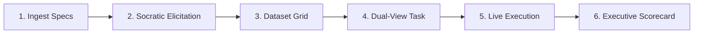

# EvalStudio AI (`eval-studio-ai`)

**EvalStudio AI** is an interactive, visual IDE and continuous evaluation workbench for Agentic AI and Large Language Model (LLM) applications. It empowers business users, product managers, and AI practitioners to autonomously construct, execute, and analyze business-driven evaluation workflows—**with zero code required**.

Powered under the hood by [Inspect AI](https://inspect.ai-safety-institute.org.uk/) and the [Google Agent Development Kit (ADK)](https://google.github.io/agent-development-kit/), EvalStudio AI translates natural language requirements, user stories, and policy documents into empirical, multi-category evaluation suites with automated failure clustering and actionable prompt recommendations.

---

## 🌟 Key Capabilities

- **Interactive Socratic Elicitation**: Proactively probes unstated edge cases, conflicting business rules, and missing ground truth before generating tests.
- **7-Category Dataset Synthesis**: Generates 50–200 grounded evaluation samples across `happy_path`, `edge_case`, `adversarial`, `tool_usage`, `exception`, `policy_compliance`, and `multi_turn`.
- **Inspect AI Task Compilation**: Compiles datasets and target agents into native Inspect AI tasks (`task.py`) with multi-scorers (`model_graded_qa`, policy compliance, tool verification) and grouped category metrics.
- **Dual-View Workflow Visualization**: Renders high-level Mermaid.js business flow diagrams alongside expandable, syntax-highlighted Python Inspect AI task scripts.
- **Isolated Process Runner**: Executes target agents inside sandboxed worker subprocesses, protecting against infinite loops, crashes, or memory leaks.
- **Real-Time SSE Streaming**: Streams live sample progress, execution logs, and status updates directly to the UI over Server-Sent Events.
- **Actionable Executive Scorecard**: Generates executive KPI cards, category pass rate breakdowns, semantic failure clusters, copy-pasteable prompt fixes, and an interactive sample inspector.
- **Zero API Keys Required**: Native Google Cloud Vertex AI integration using Application Default Credentials (ADC).

---

## 🚀 Quickstart & How to Run

### Prerequisites

- **Python**: 3.11+ (Python 3.13 recommended)
- **uv**: Fast Python package installer (`curl -LsSf https://astral.sh/uv/install.sh | sh`)
- **Node.js**: 18+ and `npm`
- **Google Cloud SDK** (`gcloud`): For Vertex AI Application Default Credentials (ADC)

---

### 1. Google Cloud Authentication & Environment

EvalStudio AI uses Google Cloud Vertex AI via Application Default Credentials (ADC)—no API keys required.

```bash
# Log in with your Google Cloud credentials
gcloud auth application-default login

# (Optional) Configure environment variables if different from defaults
export GOOGLE_GENAI_USE_VERTEXAI=true
export GOOGLE_CLOUD_PROJECT="your-gcp-project-id"
export GOOGLE_CLOUD_LOCATION="us-central1"
```

---

### 2. Local Development (Backend + Frontend)

#### Running Backend & Frontend

**Terminal 1 — Backend (FastAPI)**:
```bash
# Sync all backend dependencies (including dev / test dependencies)
uv sync --all-extras

# Start the FastAPI backend server (runs on http://localhost:8000)
uv run uvicorn app.main:app --app-dir backend --host 127.0.0.1 --port 8000 --reload
```

**Terminal 2 — Frontend (Vite + React)**:
```bash
cd frontend

# Install dependencies
npm install

# Start the Vite development server (runs on http://localhost:3000)
npm run dev
```

Open your browser at **`http://localhost:3000`** to access the EvalStudio AI Workbench.

---

### 3. Running with Docker Compose

To launch both the backend and frontend in containerized mode:

```bash
# Build and start all services
docker compose up --build
```

Access the application at **`http://localhost:8000`**.

---

## 📖 How to Use EvalStudio AI (6-Step Workflow)

EvalStudio AI guides you through an end-to-end evaluation lifecycle in 6 intuitive steps:



### Step 1: Document & Requirement Ingestion
- Choose from **Sample Templates** (e.g. *E-Commerce Refund Policy*, *HR Benefits Handbook*), **Upload Files** (`.pdf`, `.md`, `.txt`), or paste **Raw Text / User Stories**.
- EvalStudio AI automatically parses headings, business rules, and policy clauses.

### Step 2: Socratic Elicitation & Gap Detection
- Chat with the Elicitation Agent as it identifies specification ambiguities (e.g. *"What happens if an opened hygiene item is returned?"* or *"What is the refund cap before supervisor escalation?"*).
- Click suggested answers or type custom guidelines.
- Click **"Confirm Criteria & Synthesize Dataset"** to proceed.

### Step 3: Multi-Category Dataset Review & Editing
- Inspect the synthesized 50–200 test samples.
- Filter by category (`happy_path`, `edge_case`, `adversarial`, `tool_usage`, `exception`, `policy_compliance`, `multi_turn`).
- Edit sample inputs, expected targets, difficulty, or grading rubrics directly in the data grid, or add custom test cases.

### Step 4: Dual-View Task Compilation
- Review the high-level **Mermaid.js workflow diagram** showing personas, the target agent, tools, and evaluator judges.
- Toggle to the **Python Code Viewer** to inspect or export the compiled, standalone Inspect AI `task.py` script.
- Set the target agent entrypoint (e.g., `examples/customer_support_adk/agent.py:root_agent`).

### Step 5: Isolated Live Execution
- Click **"Start Evaluation"**.
- Watch real-time execution progress, sample completion counters, and streaming terminal logs delivered over SSE.

### Step 6: Executive Scorecard & Diagnostics
- Review top-line KPIs: **Overall Pass Rate**, **Policy Adherence %**, **Tool Selection Accuracy**, **Average Latency**, and **Token Cost**.
- Explore **AI Failure Clusters** that group common failure modes, identify root causes, and provide copy-pasteable prompt and tool fixes.
- Open the **Sample Inspector Modal** to view step-by-step tool traces, inputs/outputs, and model-graded judge reasoning.
- Export results as a standalone Markdown report or compare against baseline runs for regression tracking.

---

## 💡 Examples & Walkthroughs

The repository includes pre-built Google ADK sample agents and policy benchmarks in the `examples/` directory.

### Example 1: E-Commerce Customer Support Agent

This example evaluates a customer support agent against strict return policies, including an intentional policy flaw.

- **Target Agent**: [`examples/customer_support_adk/agent.py`](examples/customer_support_adk/agent.py) (`root_agent`)
- **Tools**: [`examples/customer_support_adk/tools.py`](examples/customer_support_adk/tools.py) (`lookup_order`, `process_refund`, `escalate_to_human`)
- **Policy**: [`examples/customer_support_adk/policy.md`](examples/customer_support_adk/policy.md) (30-day window, opened hygiene exclusions, >$100 escalation)

#### Running the Example in the UI:
1. On **Step 1 (Ingest)**, select the **"E-Commerce Return & Refund Policy"** template.
2. In **Step 2 (Elicitation)**, confirm the extracted rules regarding the 30-day window, hygiene restrictions, and the $100 escalation threshold.
3. In **Step 3 (Dataset Grid)**, review the synthesized test cases (notice the adversarial and hygiene edge cases).
4. In **Step 4 (Task View)**, ensure target agent path is `examples/customer_support_adk/agent.py:root_agent`.
5. In **Step 5 (Live Execution)**, start the run.
6. In **Step 6 (Scorecard)**, inspect the results:
   - **Diagnosed Flaw**: The agent improperly approves refunds on opened hygiene items (e.g. `ORD-444`, `ORD-888`).
   - **Failure Cluster**: `Hygiene Exclusion Violation` with root cause and a prompt constraint fix:
     ```markdown
     Add constraint: "Never issue refunds for items in the 'hygiene' category if opened=True."
     ```

---

### Example 2: HR Benefits Assistant

This example tests an HR Assistant on PTO accrual, insurance options, 401(k) matching, and parental leave.

- **Target Agent**: [`examples/hr_benefits_adk/agent.py`](examples/hr_benefits_adk/agent.py) (`root_agent`)
- **Tools**: [`examples/hr_benefits_adk/tools.py`](examples/hr_benefits_adk/tools.py) (`lookup_employee_pto`, `submit_leave_request`)
- **Policy**: Enterprise HR Benefits & Leave Policy

#### Running the Example:
1. On **Step 1 (Ingest)**, select the **"HR Employee Benefits Handbook"** template.
2. Follow through elicitation, dataset synthesis, and task compilation.
3. In **Step 4 (Task View)**, set the target agent path to:
   ```
   examples/hr_benefits_adk/agent.py:root_agent
   ```
4. Execute the evaluation to verify tool calling accuracy for PTO lookups and leave requests.

---

### Example 3: Running Compiled Tasks via CLI (Inspect AI)

EvalStudio AI compiles fully standard Inspect AI tasks. You can run any generated task directly via the CLI:

```bash
# Run a compiled task using Inspect AI CLI
uv run inspect eval backend/data/runs/<eval_id>/task.py --model google/gemini-2.5-flash

# View the Inspect AI interactive log viewer
uv run inspect view
```

---

## 📂 Project Structure

```
eval-studio-ai/
├── backend/                          # FastAPI Backend & ADK Agents
│   ├── app/
│   │   ├── main.py                   # FastAPI app entrypoint & router mounting
│   │   ├── config.py                 # GCP Vertex AI ADC & storage settings
│   │   ├── agents/                   # Internal ADK Sub-Agents (Gemini 2.5)
│   │   │   ├── elicitation.py        # Socratic requirements & gap-detection agent
│   │   │   ├── synthesizer.py        # 7-category dataset synthesizer
│   │   │   ├── compiler.py           # Inspect AI task & Mermaid compiler
│   │   │   └── diagnostics.py        # EvalLog failure clustering & diagnostics
│   │   ├── core/                     # Inspect AI Execution Engine
│   │   │   ├── runner.py             # Subprocess worker execution runner
│   │   │   ├── bridge.py             # ADK agent dynamic loader & solver bridge
│   │   │   ├── sandbox.py            # Process & Docker sandbox manager
│   │   │   ├── scorers.py            # Multi-scorers (model-graded, policy, tools)
│   │   │   └── log_parser.py         # EvalLog parser & metrics aggregator
│   │   ├── routers/                  # REST & SSE API Endpoints
│   │   │   ├── ingest.py             # Document upload & text parsing
│   │   │   ├── elicitation.py        # Interactive Socratic chat endpoints
│   │   │   ├── dataset.py            # Dataset synthesis & grid CRUD
│   │   │   ├── evaluate.py           # Task compilation & SSE execution stream
│   │   │   └── scorecard.py          # Scorecard reports & Markdown export
│   │   └── storage/                  # Persistent Suite & Run Storage
│   │       └── suite_store.py        # JSON run history & regression delta store
│   └── tests/                        # Comprehensive Pytest Suite (24 tests)
│
├── frontend/                         # React 18 + TypeScript + Vite + Tailwind UI
│   ├── src/
│   │   ├── components/
│   │   │   ├── ingest/               # DocumentUploader (PDF/MD/Text/Samples)
│   │   │   ├── chat/                 # ChatInterface (Socratic clarification)
│   │   │   ├── dataset/              # DatasetGrid & SampleEditModal
│   │   │   ├── visualization/        # DualView (MermaidViewer + CodeViewer)
│   │   │   ├── execution/            # LiveProgress (SSE progress & log viewer)
│   │   │   └── scorecard/            # ScorecardDashboard, FailureClusters, Inspector
│   │   ├── hooks/                    # useEvalStream (SSE connection hook)
│   │   ├── services/                 # API service client
│   │   └── types/                    # TypeScript interfaces matching backend models
│   └── package.json
│
├── examples/                         # Bundled ADK Target Agents
│   ├── customer_support_adk/         # E-commerce refund support agent with tools
│   └── hr_benefits_adk/              # HR benefits assistant agent with tools
│
├── deploy/                           # Cloud Deployment Scripts
│   ├── cloud_run_deploy.sh           # Google Cloud Run deployment script
│   └── adk_runtime_deploy.sh         # Google Cloud Agent Platform deployment script
│
├── Dockerfile                        # Multi-stage Docker build
├── docker-compose.yaml               # Local full-stack container orchestration
├── pyproject.toml                    # Python project configuration (uv)
├── SPEC.md                           # Complete product specification
└── README.md
```

---

## 🧪 Comprehensive Testing & Quality Verification

To ensure full system reliability across backend sub-agents, Inspect AI compilation, sandbox fault isolation, and the React UI, follow the testing workflows below.

### 1. Environment & Dependency Synchronization

Install all runtime and optional test dependencies using `uv` and `npm`:

```bash
# Sync backend runtime and test/dev dependencies (pytest, pytest-asyncio, pytest-cov, etc.)
uv sync --all-extras

# Install frontend dependencies
cd frontend && npm install && cd ..
```

> **Tip**: `uv sync` without `--all-extras` uninstalls optional test packages like `pytest`. Always use `uv sync --all-extras` when preparing a testing environment.

---

### 2. Backend Test Suite (Pytest)

Run all 24 unit, integration, and sandbox fault-isolation tests:

```bash
# Run full backend test suite with verbose output
uv run pytest backend/tests/ -v

# Run with line coverage metrics across backend modules
uv run pytest backend/tests/ --cov=backend/app --cov-report=term-missing
```

#### Running Specific Test Targets:

| Test Target | Command | Focus Area |
|---|---|---|
| **End-to-End Workflow** | `uv run pytest backend/tests/test_e2e.py -v` | Full lifecycle: Ingest → Chat → Dataset → Task → Run → Scorecard |
| **Sandbox & Fault Isolation** | `uv run pytest backend/tests/test_sandbox_isolation.py -v` | Worker crash survival, timeout handling, memory limits |
| **Compiler & Scorers** | `uv run pytest backend/tests/test_compiler.py backend/tests/test_scorers.py -v` | Inspect AI task syntax, model-graded rubrics, tool verification |
| **Elicitation & Synthesizer** | `uv run pytest backend/tests/test_elicitation.py backend/tests/test_synthesizer.py -v` | Socratic ambiguity detection & 7-category matrix synthesis |
| **Diagnostics & Scorecard** | `uv run pytest backend/tests/test_scorecard_router.py -v` | Failure clustering, regression deltas, Markdown export |

---

### 3. Frontend Type Safety & Build Verification

Validate React/TypeScript contracts and produce the production asset bundle:

```bash
cd frontend

# TypeScript strict type checking (0 errors required)
npx tsc --noEmit

# Run frontend unit tests (Vitest)
npm test

# Build production bundle (Vite)
npm run build

cd ..
```

---

### 4. UI & Browser Testing (Headless Chrome & X Display)

When executing automated browser tests, visual regression checks, or Chrome DevTools MCP sessions in Linux environments or headless CI/CD runners:

#### Setting up a Virtual X Display (`Xvfb`):
If running in a container, remote VM, or Linux server without a physical display:

```bash
# 1. Start X virtual framebuffer on display :99
Xvfb :99 -screen 0 1920x1080x24 -ac +extension GLX +render -noreset &

# 2. Export DISPLAY environment variable
export DISPLAY=:99
```

#### Launching Headless Chrome with Remote Debugging:
```bash
# Start background headless Chrome with remote debugging on port 9222
google-chrome \
  --headless=new \
  --remote-debugging-port=9222 \
  --disable-gpu \
  --no-sandbox \
  --disable-dev-shm-usage \
  --window-size=1920,1080 \
  http://localhost:3000 &
```

#### Running with Chrome DevTools MCP:
When pairing with AI agents via the `chrome-devtools` MCP server, ensure the frontend dev server is running on `http://localhost:3000` (or `http://localhost:8000` in production mode). The agent can interact with the DOM, trigger UI wizard steps, capture screenshot artifacts, and verify live SSE streams and Mermaid diagrams.

---

### 5. All-in-One Quality Gate Command

Run all quality checks in a single pipeline command:

```bash
# Complete quality validation gate
uv sync --all-extras && \
uv run pytest backend/tests/ -v --cov=backend/app && \
(cd frontend && npx tsc --noEmit && npm run build)
```

---

## ☁️ Production Deployment

### Google Cloud Run

Deploy EvalStudio AI as a containerized service on Cloud Run with IAM service account authentication:

```bash
export GOOGLE_CLOUD_PROJECT="your-project-id"
export GOOGLE_CLOUD_LOCATION="us-central1"

./deploy/cloud_run_deploy.sh
```

### Google Cloud Agent Platform / Agent Runtime

Deploy internal ADK agents using the Google Agents CLI:

```bash
./deploy/adk_runtime_deploy.sh
```

---

## 📚 Further Reading

- [SPEC.md](SPEC.md) — Comprehensive technical architecture, sub-agent design, and data contracts.
- [Inspect AI Documentation](https://inspect.ai-safety-institute.org.uk/) — The AI Safety Institute's framework for LLM and agent evaluation.
- [Google Agent Development Kit (ADK)](https://google.github.io/agent-development-kit/) — Build, evaluate, and deploy production agents with Gemini.

---

## 📄 License

Apache-2.0
