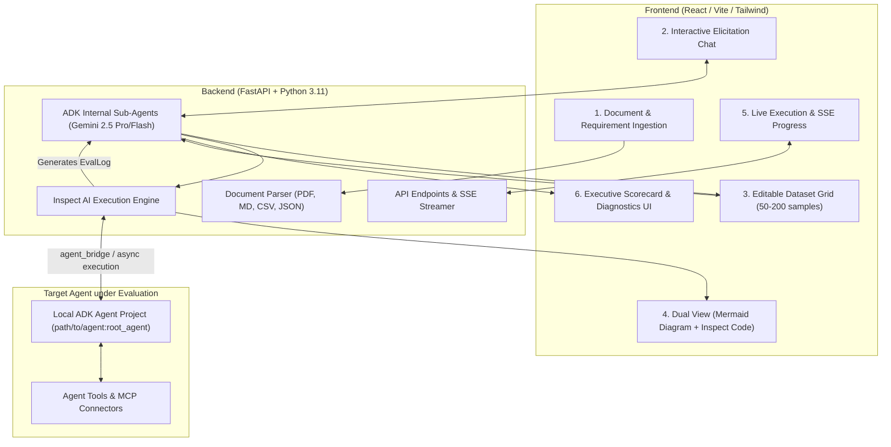

# Spec: EvalStudio AI (Phase 1)

## 1. Objective

**EvalStudio AI** is an agentic web application that empowers business users, product managers, and AI practitioners to generate, execute, and analyze comprehensive [Inspect AI](https://github.com/UKGovernmentBEIS/inspect_ai) evaluation suites for Google Agent Development Kit (ADK) agents—**with zero code required**.

Users provide plain-English requirements, user stories, policy documents (PDF/Markdown/Text), or raw examples. EvalStudio AI autonomously discovers ambiguities, synthesizes rich evaluation datasets (50–200 categorized samples), compiles a complete Inspect AI task harness, executes the evaluation against local ADK agent projects, and transforms low-level `EvalLog` transcripts into an executive scorecard with plain-English diagnostics and actionable recommendations.

### Key Value Propositions
* **Zero-Code to Full Rigor**: Bridges the steep learning curve of Inspect AI while retaining its research-grade evaluation capabilities.
* **Interactive Elicitation**: Proactively detects gaps and ambiguous rules in business policies before generating test cases.
* **Dual Visualization**: Presents evaluation workflows as business-friendly Mermaid.js sequence/flow diagrams, while providing power users full access to the generated Python task code.
* **Closed-Loop Diagnostics**: Translates raw JSON/JSONL evaluation logs into failure clusters, root-cause analyses, and actionable prompt/tool improvements.

---

## 2. Scope & Phase Boundaries

### In-Scope for Phase 1
1. **Target Agent Execution**: Local ADK agent projects specified via directory path and factory entrypoint (e.g. `path/to/my_agent:agent` or `main.py:root_agent`), executed in-process via Inspect AI's `agent_bridge` or direct async runner.
2. **Internal Agent Architecture**: Sub-agents built using Google ADK and Gemini 2.5 Pro / Flash:
   * **Elicitation & Gap-Detection Agent**: Scans documents for missing ground truth and rules.
   * **Dataset Synthesizer Agent**: Generates 50–200 categorized test samples (Happy Path, Boundary Conditions, Adversarial, Tool Invocations).
   * **Inspect Task Compiler**: Generates runnable Inspect AI Python tasks with custom `model_graded_qa` rubrics and tool call handlers.
   * **Diagnostic Analysis Agent**: Parses `EvalLog` transcripts, clusters failure modes, and produces plain-English recommendations.
3. **Interactive Data Grid**: Web UI for inspecting, editing, filtering, adding, and deleting synthesized test samples prior to execution.
4. **Dual-View Task Presentation**: High-level Mermaid.js business flow diagram + expandable Inspect AI Python code viewer.
5. **Tool & MCP Support**: Inspects tool calls made by the ADK agent, including custom Python tools and Model Context Protocol (MCP) server tools.
6. **Executive Scorecard UI**: Top-line KPI cards (Pass %, Policy Adherence, Tool Accuracy, Latency/Cost), AI failure clusters, actionable recommendations, and an interactive sample inspector with judge reasoning.
7. **Deployment**: Local execution (development & demo) and containerized deployment for Google Cloud Run.

### Out of Scope (Deferred to Phase 2)
* Direct evaluation of live, remote cloud-deployed agents behind authenticated Cloud Run / Vertex AI Agent Runtime endpoints (Phase 1 focuses on local ADK projects).
* Automated Cloud Scheduler cron jobs in GCP.
* Multi-agent red-teaming arena with autonomous attacker swarms.
* Automated DSPy-style multi-iteration prompt mutation loops (Phase 1 provides human-actionable prompt recommendations).

---

## 3. System Architecture



---

## 4. Tech Stack

| Layer | Technology | Rationale |
|---|---|---|
| **Backend Framework** | FastAPI (Python 3.11+) | Async native, high-performance, native integration with Inspect AI & Google ADK. |
| **Eval Engine** | Inspect AI (`inspect-ai >= 0.3.50`) | Industry-standard evaluation framework with rich datasets, solvers, scorers, and `EvalLog`. |
| **Internal Agents** | Google ADK (`google-agents`) + Gemini 2.5 Pro / Flash | State-of-the-art reasoning for gap detection, dataset synthesis, and log diagnostic analysis. |
| **Frontend Framework** | React 18 / TypeScript + Vite | Fast, responsive, component-driven UI. |
| **Styling & Icons** | Tailwind CSS + Lucide React + Radix UI | Clean, accessible, modern design system. |
| **Visualizations** | Mermaid.js / react-mermaid + Recharts | Renders dynamic sequence/flow diagrams and executive metric charts. |
| **Deployment / Packaging** | Docker + Google Cloud Run | Single-container or multi-stage container deployable locally and to GCP. |

---

## 5. Sub-Agent Workflows & Data Contracts

### 5.1 Elicitation & Gap-Detection Agent
* **Input**: Uploaded policy documents (PDF, Markdown, Text), user stories, target agent description, and known tools/APIs.
* **Process**:
  1. Analyzes rules, boundaries, and expected workflows.
  2. Detects ambiguous clauses, missing edge-case handling, or unspecified tool behaviors.
  3. Formulates targeted clarification questions for the user in the UI.
* **Output**: Structured requirement schema and confirmed evaluation criteria.

### 5.2 Dataset Synthesizer Agent
* **Input**: Confirmed requirements, extracted domain rules, and sample targets.
* **Process**: Generates a balanced matrix of 50–200 test cases categorized into:
  * `happy_path`: Typical user requests with clear solutions.
  * `edge_case`: Boundary conditions, ambiguous inputs, conflicting policies.
  * `adversarial`: Off-topic prompts, prompt injection attempts, out-of-scope requests.
  * `tool_usage`: Scenarios requiring specific tool calls with expected arguments.
* **Output**: JSON schema representing `EvalDataset` with fields: `id`, `category`, `input_prompt`, `expected_target`, `grading_rubric`, `expected_tools`.

### 5.3 Inspect Task Compiler
* **Input**: Approved dataset and target agent metadata.
* **Process**:
  1. Generates an Inspect `Task` using Python API.
  2. Configures dataset using `MemoryDataset` or `json_dataset`.
  3. Wraps the target local ADK agent with `agent_bridge` or custom solver.
  4. Configures `model_graded_qa()` with custom rubrics extracted from business policy.
  5. Generates the Mermaid sequence/flowchart diagram definition.
* **Output**: Runnable Python code (`task.py`) and Mermaid diagram definition (`diagram.mmd`).

### 5.4 Diagnostic Analysis Agent
* **Input**: Inspect `EvalLog` (containing per-sample messages, tool calls, model outputs, and scorer results).
* **Process**:
  1. Computes aggregate KPI metrics (Overall Pass Rate, Policy Adherence %, Tool Accuracy %, Latency/Token cost).
  2. Clusters failed samples into thematic buckets (e.g., "Policy Rule Misinterpretation", "Tool Argument Schema Mismatch", "Hallucinated Policy").
  3. Formulates plain-English root causes and generates concrete, copy-pasteable prompt and tool improvements.
* **Output**: Structured `ExecutiveScorecardReport` schema.

---

## 6. Project Structure

```
eval-studio-ai/
├── SPEC.md                           # This specification
├── Dockerfile                        # Container configuration for Local & Cloud Run
├── docker-compose.yaml               # Local multi-service runner
├── requirements.txt                  # Python dependencies
│
├── backend/                          # FastAPI Backend Application
│   ├── app/
│   │   ├── main.py                   # FastAPI entrypoint and route mounting
│   │   ├── config.py                 # Environment variables & Google Cloud settings
│   │   │
│   │   ├── agents/                   # Google ADK Internal Sub-Agents
│   │   │   ├── elicitation.py        # Gap-detection and requirements interviewer
│   │   │   ├── synthesizer.py        # 50-200 sample dataset generator
│   │   │   ├── compiler.py           # Inspect AI task & Mermaid generator
│   │   │   └── diagnostics.py        # EvalLog parser & diagnostic reporter
│   │   │
│   │   ├── core/                     # Inspect AI Orchestration Engine
│   │   │   ├── runner.py             # inspect_ai.eval() async execution runner
│   │   │   ├── bridge.py             # ADK local agent loader & bridge wrapper
│   │   │   └── log_parser.py         # EvalLog extractor & metrics aggregator
│   │   │
│   │   ├── models/                   # Pydantic Schemas & Data Contracts
│   │   │   ├── elicitation.py        # Ingestion & clarification schemas
│   │   │   ├── dataset.py            # Sample, Category, and Dataset schemas
│   │   │   ├── task.py               # Inspect Task metadata & Mermaid model
│   │   │   └── scorecard.py          # KPI metrics, clusters & recommendations
│   │   │
│   │   ├── routers/                  # REST & SSE API Endpoints
│   │   │   ├── ingest.py             # Document upload & requirement endpoints
│   │   │   ├── dataset.py            # Dataset CRUD & synthesis endpoints
│   │   │   ├── evaluate.py           # Task compilation & execution SSE stream
│   │   │   └── scorecard.py          # Diagnostic reports & export endpoints
│   │   │
│   │   └── utils/                    # Document parsers & file helpers
│   │       ├── pdf_parser.py         # PDF text & structure extractor
│   │       └── code_generator.py     # Python task code formatter
│   │
│   └── tests/                        # Backend Unit & Integration Tests
│       ├── test_elicitation.py
│       ├── test_synthesizer.py
│       ├── test_compiler.py
│       ├── test_runner.py
│       └── test_diagnostics.py
│
├── frontend/                         # React + Vite + Tailwind Frontend
│   ├── src/
│   │   ├── components/
│   │   │   ├── layout/               # Header, Sidebar, Step Navigator
│   │   │   ├── ingest/               # Doc uploader & requirement input
│   │   │   ├── chat/                 # Elicitation chat interface
│   │   │   ├── dataset/              # Interactive editable data grid
│   │   │   ├── visualization/        # Mermaid diagram & code split-view
│   │   │   ├── execution/            # Real-time SSE progress bar & live logs
│   │   │   └── scorecard/            # KPI cards, failure clusters, sample inspector
│   │   │
│   │   ├── hooks/                    # Custom React hooks (useEvalStream, useDataset)
│   │   ├── services/                 # API client (Axios/fetch client)
│   │   ├── types/                    # TypeScript interfaces
│   │   ├── App.tsx                   # Main wizard application container
│   │   └── main.tsx                  # Vite React mount
│   │
│   ├── package.json
│   ├── vite.config.ts
│   └── tailwind.config.js
│
└── examples/                         # Sample ADK Agents for Demo & Testing
    ├── customer_support_adk/         # E-commerce refund/support ADK agent
    │   ├── agent.py                  # ADK agent definition
    │   ├── tools.py                  # Order lookup & refund tools
    │   └── policy.md                 # Company policy documentation
    └── hr_benefits_adk/              # HR handbook QA agent
```

---

## 7. API Data Contracts

### 7.1 Dataset Sample Schema (`backend/app/models/dataset.py`)
```python
from pydantic import BaseModel, Field
from typing import Literal, Optional, List, Dict, Any

class EvalSampleModel(BaseModel):
    id: str = Field(..., description="Unique sample identifier (e.g. sample-001)")
    category: Literal["happy_path", "edge_case", "adversarial", "tool_usage"]
    input_prompt: str = Field(..., description="User query sent to the target agent")
    expected_target: str = Field(..., description="Ground truth answer or expected outcome")
    grading_rubric: str = Field(..., description="Specific rubric for model-graded scorer")
    expected_tools: Optional[List[str]] = Field(default=None, description="Expected tool names")
    metadata: Dict[str, Any] = Field(default_factory=dict)

class EvalDatasetModel(BaseModel):
    name: str
    description: str
    samples: List[EvalSampleModel]
    total_count: int
```

### 7.2 Scorecard & Diagnostics Schema (`backend/app/models/scorecard.py`)
```python
from pydantic import BaseModel, Field
from typing import List, Dict, Any, Optional

class MetricSummary(BaseModel):
    overall_pass_rate: float
    policy_adherence_score: float
    tool_selection_accuracy: float
    total_samples: int
    passed_samples: int
    failed_samples: int
    avg_latency_seconds: float
    estimated_token_cost_usd: float

class FailureCluster(BaseModel):
    cluster_id: str
    title: str
    description: str
    failure_count: int
    sample_ids: List[str]
    root_cause: str
    suggested_fix: str

class SampleInspectionResult(BaseModel):
    sample_id: str
    category: str
    input_prompt: str
    expected_target: str
    actual_output: str
    score: float
    passed: bool
    judge_reasoning: str
    tool_calls_made: List[Dict[str, Any]]
    full_transcript: List[Dict[str, Any]]

class ExecutiveScorecardReport(BaseModel):
    eval_id: str
    task_name: str
    timestamp: str
    metrics: MetricSummary
    executive_summary: str
    failure_clusters: List[FailureCluster]
    actionable_recommendations: List[str]
    sample_details: List[SampleInspectionResult]
```

---

## 8. Commands & Execution

### 8.1 Development
```bash
# Backend setup and dev server
cd backend
python3 -m venv .venv
source .venv/bin/activate
pip install -r requirements.txt
uvicorn app.main:app --reload --port 8000

# Frontend setup and dev server
cd frontend
npm install
npm run dev

# Run full app via Docker Compose
docker compose up --build
```

### 8.2 Testing
```bash
# Run backend unit and integration tests
cd backend
pytest tests/ -v --cov=app

# Run frontend unit tests
cd frontend
npm run test

# Run end-to-end demo evaluation test
pytest tests/test_runner.py -k "test_customer_support_adk"
```

### 8.3 Google Cloud Run Deployment
```bash
# Build and deploy to Google Cloud Run
gcloud builds submit --tag gcr.io/$PROJECT_ID/eval-studio-ai
gcloud run deploy eval-studio-ai \
    --image gcr.io/$PROJECT_ID/eval-studio-ai \
    --platform managed \
    --region us-central1 \
    --allow-unauthenticated \
    --set-env-vars GOOGLE_API_KEY=$GOOGLE_API_KEY
```

---

## 9. Testing & Quality Strategy

1. **Unit Tests**:
   * Elicitation parser and prompt extraction accuracy.
   * Dataset synthesis schema validation and 50–200 sample distribution.
   * Inspect AI task code generation syntax validity.
   * `EvalLog` parsing and metric aggregation math.
2. **Integration Tests**:
   * In-process execution of sample ADK agents (`examples/customer_support_adk`) using `inspect_ai.eval()`.
   * Model-graded scoring with mock and live Gemini 2.5 judges.
   * Server-Sent Events (SSE) streaming verification for real-time progress.
3. **Frontend Component Tests**:
   * Data grid editing, filtering, and add/delete operations.
   * Mermaid diagram rendering and error fallback.
   * Scorecard KPI display and sample inspector modal.

---

## 10. Boundaries

### Always Do
* Follow strict Pydantic data validation on all API boundaries.
* Ensure synthesized datasets have clear category distributions (`happy_path`, `edge_case`, `adversarial`, `tool_usage`).
* Include explicit Judge reasoning in every model-graded evaluation result.
* Gracefully handle syntax or schema errors in user-provided documents with actionable UI error toasts.
* Isolate target agent execution so crashes in the evaluated agent do not crash the EvalStudio backend.

### Ask First
* Modifying the core `EvalSampleModel` or `ExecutiveScorecardReport` API contracts.
* Introducing additional heavy dependencies or external cloud services beyond Cloud Run.
* Changing the default sample generation volume (50–200 range).

### Never Do
* Hardcode Google Cloud project IDs or API keys in source files or git history.
* Silently discard failed test cases or scoring errors without logging them in the scorecard.
* Strip Inspect AI's low-level tool trace details when formatting the human-readable transcripts.

---

## 11. Success Criteria (Definition of Done for Phase 1)

1. **End-to-End Workflow**: A user can upload the sample customer support policy PDF, state requirements via chat, review a synthesized 50-sample dataset, view the Mermaid sequence diagram, run the evaluation against the sample ADK agent, and view the Executive Scorecard with failure clusters—**all within under 3 minutes without writing code**.
2. **Inspect AI Compliance**: The generated Python task script is 100% valid Inspect AI code that can also be executed independently via CLI (`inspect eval task.py`).
3. **Diagnostic Quality**: The Diagnostic Agent correctly identifies known deliberate flaws in the sample ADK agent (e.g. violating the refund policy on opened goods) and suggests the correct prompt/tool fix.
4. **Deployability**: The application runs seamlessly both locally (`docker compose up`) and deployed on Google Cloud Run.
