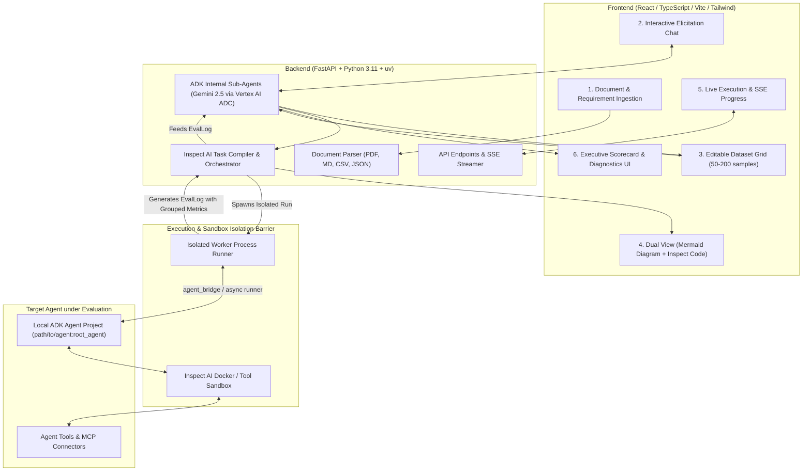

# Spec: EvalStudio AI (Phase 1)

## 1. Objective

**EvalStudio AI** is an agentic web application that empowers business users, product managers, and AI practitioners to analyze evaluation problems for their GenAI agents and LLM applications, and autonomously construct, execute, and analyze business-driven evaluation workflows—**with zero code required**.

Users provide plain-English requirements, user stories, policy documents (PDF/Markdown/Text), or raw examples. EvalStudio AI's intelligent agents analyze the domain problem, discover ambiguities, synthesize rich evaluation datasets (50–200 categorized samples), compile a functional evaluation harness (powered under the hood by [Inspect AI](https://inspect.aisi.org.uk/)), execute the evaluation against local Google Agent Development Kit (ADK) agent projects in an isolated sandbox runner, and deeply analyze the evaluation results to produce an executive scorecard with plain-English diagnostics and actionable recommendations.

### Architectural Focus & Separation of Concerns
* **Focus on the Business Problem & Results**: The core objective of EvalStudio AI is understanding the user's domain requirements, formulating the right evaluation strategy, and diagnosing agent performance and failure modes.
* **Inspect AI as the Execution Engine**: Inspect AI provides the underlying execution harness (datasets, solvers, scorers, and logging). EvalStudio AI abstracts away framework complexity and low-level mechanics, visualizing the evaluation workflow in user-friendly business terms while allowing optional code export for power users.
* **Native Google Cloud Vertex AI & ADK Ecosystem Alignment**: EvalStudio AI internal agents and evaluator judges are built using Google ADK and Gemini 2.5 on Google Cloud Vertex AI using Application Default Credentials (ADC). The system supports standard `agents-cli deploy` workflows to Google Cloud Agent Platform / Agent Runtime and Cloud Run.
* **Modern Python Tooling**: Uses `uv` for fast, reproducible dependency and virtual environment management.
* **Resilient Sandbox & Execution Isolation**: Target agents run in isolated worker subprocesses and optional Docker sandboxes, ensuring target crashes or tool failures never compromise the EvalStudio backend.

### Key Value Propositions
* **Business-First Evaluation Analysis**: Analyzes domain requirements and user stories to define clear, measurable quality, policy adherence, and safety criteria for the application under test.
* **Zero-Code Workflow Generation**: Translates business criteria into a complete, functional evaluation harness (leveraging Inspect AI) without requiring users to write Python code.
* **Interactive Elicitation & Gap Detection**: Proactively detects unaddressed edge cases, conflicting policies, or missing ground truth before generating test suites.
* **Comprehensive Multi-Category Test Suites**: Synthesizes balanced datasets covering happy paths, edge cases, adversarial attacks, tool usage, exceptions/error handling, and policy compliance.
* **Proactive Diagnostic Scorer Compilation**: Compiles multi-scorer evaluation tasks that automatically collect categorized metrics (`grouped()`), tool selection accuracy, and policy compliance for downstream diagnostics.
* **User-Centric Workflow Visualization**: Renders the evaluation process as high-level business Mermaid.js sequence and flow diagrams (Personas → Target Agent → Tools → Evaluator Judge).
* **Closed-Loop Actionable Diagnostics**: Ingests execution transcripts and translates raw evaluation logs into categorized failure clusters, root causes, and copy-pasteable prompt/tool recommendations.

---

## 2. Scope & Phase Boundaries

### In-Scope for Phase 1
1. **Target Agent Execution & Process Isolation**: Local ADK agent projects specified via directory path and factory entrypoint (e.g. `path/to/my_agent:agent` or `main.py:root_agent`), executed inside an isolated runner process via Inspect AI's `agent_bridge` or async execution harness with Docker sandbox support for tool safety.
2. **Internal Agent Architecture**: Sub-agents built using Google ADK and Gemini 2.5 Pro / Flash on Vertex AI (authenticated via ADC):
   * **Elicitation & Gap-Detection Agent**: Analyzes domain documents and prompts user to clarify ambiguous rules or missing ground truth.
   * **Dataset Synthesizer Agent**: Generates 50–200 categorized test samples (`happy_path`, `edge_case`, `adversarial`, `tool_usage`, `exception`, `policy_compliance`, `multi_turn`) structured in native Inspect AI `Sample` schema (`id`, `input`, `target`, `metadata`).
   * **Inspect Task Compiler**: Proactively curates multi-scorers (`model_graded_qa`, policy compliance, tool verification) and grouped diagnostic metrics (`grouped(accuracy(), "category")`, `grouped(mean(), "category")`, `stderr()`, `ci()`), compiling the workflow into a runnable Inspect AI task.
   * **Diagnostic Analysis Agent**: Analyzes evaluation results from `EvalLog` transcripts, clusters failure modes, identifies tool/policy bugs, and produces plain-English recommendations.
3. **Interactive Data Grid**: Web UI for inspecting, editing, filtering, adding, and deleting synthesized test samples prior to execution.
4. **Dual-View Task Presentation**: High-level Mermaid.js business flow diagram as primary visual + expandable Inspect AI Python code viewer.
5. **Tool & MCP Support**: Inspects tool calls made by the ADK agent, including custom Python tools and Model Context Protocol (MCP) server tools.
6. **Executive Scorecard UI**: Top-line KPI cards (Pass %, Category Breakdowns, Policy Adherence, Tool Accuracy, Latency/Cost), AI failure clusters, actionable recommendations, and an interactive sample inspector with judge reasoning.
7. **Authentication & Deployment**: Pure GCP Application Default Credentials (ADC) with Vertex AI (`GOOGLE_GENAI_USE_VERTEXAI=true`). Local development with `uv`, native ADK deployment via `agents-cli deploy`, and containerized deployment for Google Cloud Run with IAM service accounts.

### Out of Scope (Deferred to Phase 2)
* Direct evaluation of live, remote cloud-deployed agents behind authenticated Cloud Run / Vertex AI Agent Runtime endpoints (Phase 1 focuses on local ADK projects).
* Automated Cloud Scheduler cron jobs in GCP.
* Multi-agent red-teaming arena with autonomous attacker swarms.
* Automated DSPy-style multi-iteration prompt mutation loops (Phase 1 provides human-actionable prompt recommendations).

---

## 3. System Architecture



---

## 4. Tech Stack

| Layer | Technology | Rationale |
|---|---|---|
| **Package & Env Manager** | `uv` (`pyproject.toml`) | Ultra-fast Python package resolver, virtual environment manager, and script runner. |
| **Backend Framework** | FastAPI (Python 3.11+) | Async native, high-performance, native integration with Inspect AI & Google ADK. |
| **Eval Engine** | Inspect AI (`inspect-ai >= 0.3.50`) | Industry-standard evaluation framework with datasets, solvers, multi-scorers, grouped metrics, and `EvalLog`. |
| **Internal Agents & Judges** | Google ADK (`google-agents`) + Gemini 2.5 Pro / Flash | State-of-the-art reasoning for gap detection, dataset synthesis, and log diagnostic analysis. |
| **LLM & Cloud Auth** | Google Cloud Vertex AI via ADC | Secure enterprise authentication using Google Application Default Credentials (`GOOGLE_GENAI_USE_VERTEXAI=true`, `GOOGLE_CLOUD_PROJECT`, `GOOGLE_CLOUD_LOCATION`). **Zero API keys required.** |
| **Execution Sandboxing** | Subprocess Worker + Inspect Docker Sandbox | Isolates target agent code execution and tool execution to prevent memory leaks or crashes from impacting the web server. |
| **Frontend Framework** | React 18 / TypeScript + Vite | Fast, responsive, component-driven UI. |
| **Styling & Icons** | Tailwind CSS + Lucide React + Radix UI | Clean, accessible, modern design system. |
| **Visualizations** | Mermaid.js / react-mermaid + Recharts | Renders dynamic sequence/flow diagrams and executive metric charts. |
| **Deployment / Packaging** | `agents-cli deploy` + Docker / Cloud Run | Native ADK deployment to Google Cloud Agent Platform / Agent Runtime & Cloud Run with IAM service account authentication. |

---

## 5. Sub-Agent Workflows & Data Contracts

### 5.1 Elicitation & Gap-Detection Agent
* **Input**: Business story and/or use case (plain text prompts), uploaded policy documents (PDF, Markdown, Text), user stories, target agent description, and known tools/APIs.
* **Process**:
  1. Analyzes domain rules, boundaries, and expected agent behavior.
  2. Detects ambiguous clauses, missing edge-case handling, unspecified tool behaviors, or conflicting business policies.
  3. Formulates targeted clarification questions for the user in the UI.
* **Output**: Structured requirement schema and confirmed evaluation criteria (the foundation for dataset synthesis and task compilation).

### 5.2 Dataset Synthesizer Agent
* **Input**: Confirmed requirements, extracted domain rules, and sample targets.
* **Process**: Generates a balanced matrix of 50–200 test cases categorized across a comprehensive taxonomy:
  * `happy_path`: Canonical user journeys and typical requests with clear expected resolutions.
  * `edge_case`: Boundary values, ambiguous prompts, complex multi-intent requests, and subtle constraints.
  * `adversarial`: Prompt injection attempts, jailbreaks, persona overrides, out-of-scope requests, and malicious inputs.
  * `tool_usage`: Scenarios requiring specific tool invocations, parameter extraction, and multi-step tool sequencing.
  * `exception`: Scenarios with missing/invalid user inputs, simulated tool/API failures (e.g. downstream 404/500 errors), or malformed inputs requiring graceful degradation.
  * `policy_compliance`: Hard safety/business rules and negative constraints (e.g. refusing non-refundable returns, unauthorized data queries) requiring strict adherence or human escalation.
  * `multi_turn`: Multi-step conversational flows testing context retention and state maintenance across turns.
* **Output**: Evaluation dataset compatible with Inspect AI (`inspect_ai.dataset.Sample`), containing:
  * `id`: Unique sample identifier (e.g. `sample-001`).
  * `input`: The user query or `ChatMessage` sequence submitted to the agent.
  * `target`: Ground truth answer, ideal outcome narrative, or expected state.
  * `metadata`: Structured dictionary containing:
    * `category`: One of `["happy_path", "edge_case", "adversarial", "tool_usage", "exception", "policy_compliance", "multi_turn"]`.
    * `grading_rubric`: Custom domain criteria for model-graded scoring.
    * `expected_tools`: List of expected tool names (and optional parameter assertions).
    * `difficulty`: `"easy"` | `"medium"` | `"hard"`.
    * `policy_rule_id`: Identifier of the specific policy clause being tested.
  * `choices`: (Optional) Multiple choice options when applicable.
  * `sandbox`: (Optional) Sandbox environment configuration if sample requires specific files or environment.
  * `files`: (Optional) Virtual sandbox files to provision per sample.
  * `setup`: (Optional) Per-sample setup script.

### 5.3 Inspect Task Compiler
* **Input**: Approved dataset, target agent metadata, and evaluation objectives.
* **Process (Proactive Diagnostic Curation)**:
  1. **Task & Dataset Setup**: Compiles an Inspect `Task` using `MemoryDataset` or `json_dataset` with Inspect `Sample` records.
  2. **Agent Bridging & Sandboxing**: Wraps the local ADK agent with `agent_bridge` or custom async solver, attaching tool definitions and configuring the Docker/process sandbox.
  3. **Multi-Scorer Assembly**: Curates a comprehensive scorer suite to supply granular evidence to the Diagnostic Analysis Agent:
     * **Primary Quality Scorer**: `model_graded_qa()` with domain-specific grading rubrics derived during elicitation.
     * **Policy Adherence Scorer**: Model-graded compliance judge assessing boundary adherence, negative constraints, and refusal accuracy.
     * **Tool Verification Scorer**: Deterministic scorer comparing actual tool calls and arguments against `expected_tools` in sample metadata.
     * **Deterministic Matching**: `match()` or `includes()` where exact ground truth targets exist.
  4. **Diagnostic Metrics Configuration**: Thoughtfully attaches metric aggregations to the task:
     * `grouped(accuracy(), "category")`: Computes individual accuracy scores for each test category (`happy_path`, `edge_case`, `adversarial`, `tool_usage`, `exception`, `policy_compliance`, `multi_turn`) plus aggregate `"all"`.
     * `grouped(mean(), "category")`: Computes continuous grade distributions across categories.
     * `stderr()` and `ci()`: Computes confidence intervals and statistical error bounds.
  5. **Fault Tolerance & Limit Settings**: Sets `fail_on_error=False` (or a threshold e.g. `0.2`) and execution limits (`time_limit`, `message_limit`) to ensure individual sample errors do not crash the evaluation run while capturing exception stack traces for diagnostics.
  6. **Visualization Generation**: Generates the Mermaid sequence/flowchart diagram definition representing the business evaluation flow.
* **Output**: Runnable Python Inspect task script (`task.py`) and Mermaid diagram definition (`diagram.mmd`).

### 5.4 Diagnostic Analysis Agent
* **Input**: Inspect `EvalLog` containing per-sample messages, tool calls, model outputs, scorer results, and `grouped()` category metrics.
* **Process**:
  1. **KPI Aggregation**: Extracts top-line metrics (Overall Pass Rate, Category Pass Rates, Policy Adherence %, Tool Accuracy %, Latency, Token Cost).
  2. **Failure Clustering**: Groups failed and errored samples into semantic clusters (e.g. "Policy Rule Misinterpretation", "Tool Argument Schema Mismatch", "Incomplete Exception Handling", "Adversarial Prompt Vulnerability").
  3. **Root-Cause Analysis**: Correlates judge reasoning, conversation transcripts, and tool traces to pinpoint exact prompt deficiencies or tool schema bugs.
  4. **Actionable Recommendations**: Generates concrete, copy-pasteable prompt modifications, tool schema fixes, and boundary constraints.
* **Output**: Structured `ExecutiveScorecardReport` schema.

---

## 6. Project Structure

```
eval-studio-ai/
├── SPEC.md                           # This specification
├── pyproject.toml                    # uv project configuration and Python dependencies
├── uv.lock                           # uv reproducible lockfile
├── Dockerfile                        # Multi-stage container for Backend & Cloud Run
├── docker-compose.yaml               # Local multi-service runner (Frontend + Backend + Sandbox)
│
├── backend/                          # FastAPI Backend & ADK Agent Application
│   ├── app/
│   │   ├── main.py                   # FastAPI entrypoint and route mounting
│   │   ├── config.py                 # GCP Vertex AI ADC & runtime settings
│   │   │
│   │   ├── agents/                   # Google ADK Internal Sub-Agents (Gemini 2.5 via Vertex AI)
│   │   │   ├── elicitation.py        # Gap-detection and requirements interviewer
│   │   │   ├── synthesizer.py        # Multi-category dataset generator
│   │   │   ├── compiler.py           # Inspect AI task & Mermaid generator (with multi-scorers & grouped metrics)
│   │   │   └── diagnostics.py        # EvalLog parser & diagnostic reporter
│   │   │
│   │   ├── core/                     # Inspect AI Orchestration Engine
│   │   │   ├── runner.py             # inspect_ai.eval() async execution runner with process isolation
│   │   │   ├── sandbox.py            # Target agent isolation worker & Docker sandbox interface
│   │   │   ├── bridge.py             # ADK local agent loader & bridge wrapper
│   │   │   ├── scorers.py            # Custom diagnostic scorers (ToolVerification, PolicyAdherence)
│   │   │   └── log_parser.py         # EvalLog extractor & metrics aggregator
│   │   │
│   │   ├── models/                   # Pydantic Schemas & Data Contracts (Inspect AI Compatible)
│   │   │   ├── elicitation.py        # Ingestion & clarification schemas
│   │   │   ├── dataset.py            # Sample, Category, and Dataset schemas
│   │   │   ├── task.py               # Inspect Task metadata & Mermaid model
│   │   │   └── scorecard.py          # KPI metrics, clusters & recommendations
│   │   │
│   │   ├── routers/                  # REST & SSE API Endpoints
│   │   │   ├── ingest.py             # Document upload & requirement endpoints
│   │   │   ├── dataset.py            # Dataset CRUD & synthesis endpoints
│   │   │   ├── evaluate.py           # Task compilation & execution SSE stream
│   │   │   └── scorecard.py          # Diagnostic reports & export endpoints
│   │   │
│   │   └── utils/                    # Document parsers & file helpers
│   │       ├── pdf_parser.py         # PDF text & structure extractor
│   │       └── code_generator.py     # Python task code formatter
│   │
│   └── tests/                        # Backend Unit & Integration Tests
│       ├── test_elicitation.py
│       ├── test_synthesizer.py
│       ├── test_compiler.py
│       ├── test_runner.py
│       ├── test_sandbox_isolation.py
│       └── test_diagnostics.py
│
├── frontend/                         # React + TypeScript + Vite + Tailwind Frontend
│   ├── src/
│   │   ├── components/
│   │   │   ├── layout/               # Header, Sidebar, Step Navigator
│   │   │   ├── ingest/               # Doc uploader & requirement input
│   │   │   ├── chat/                 # Elicitation chat interface
│   │   │   ├── dataset/              # Interactive editable data grid (with category filters)
│   │   │   ├── visualization/        # Mermaid diagram & code split-view
│   │   │   ├── execution/            # Real-time SSE progress bar & live logs
│   │   │   └── scorecard/            # KPI cards, category breakdown, failure clusters, sample inspector
│   │   │
│   │   ├── hooks/                    # Custom React hooks (useEvalStream, useDataset)
│   │   ├── services/                 # API client (Axios/fetch client)
│   │   ├── types/                    # TypeScript interfaces matching backend Pydantic models
│   │   ├── App.tsx                   # Main wizard application container
│   │   └── main.tsx                  # Vite React mount
│   │
│   ├── package.json
│   ├── vite.config.ts
│   └── tailwind.config.js
│
└── examples/                         # Sample ADK Agents for Demo & Testing
    ├── customer_support_adk/         # E-commerce refund/support ADK agent
    │   ├── agent.py                  # ADK agent definition
    │   ├── tools.py                  # Order lookup & refund tools
    │   └── policy.md                 # Company policy documentation
    └── hr_benefits_adk/              # HR handbook QA agent
```

---

## 7. API Data Contracts

### 7.1 Dataset Sample Schema (`backend/app/models/dataset.py`)
Directly compatible with Inspect AI's `Sample` class (`inspect_ai.dataset.Sample`):

```python
from pydantic import BaseModel, Field
from typing import Literal, Optional, List, Dict, Any, Union

EvalCategory = Literal[
    "happy_path",
    "edge_case",
    "adversarial",
    "tool_usage",
    "exception",
    "policy_compliance",
    "multi_turn"
]

class EvalSampleMetadata(BaseModel):
    category: EvalCategory = Field(..., description="Evaluation category")
    grading_rubric: Optional[str] = Field(default=None, description="Criteria for model-graded judge")
    expected_tools: Optional[List[str]] = Field(default=None, description="Expected tool names to be invoked")
    difficulty: Optional[Literal["easy", "medium", "hard"]] = Field(default="medium")
    policy_rule_id: Optional[str] = Field(default=None, description="Referenced policy clause ID")
    custom_metadata: Dict[str, Any] = Field(default_factory=dict)

class EvalSampleModel(BaseModel):
    id: str = Field(..., description="Unique sample identifier (e.g. sample-001)")
    input: Union[str, List[Dict[str, Any]]] = Field(..., description="Prompt string or ChatMessage list submitted to agent")
    target: Union[str, List[str]] = Field(..., description="Ideal ground truth outcome or narrative criteria")
    choices: Optional[List[str]] = Field(default=None, description="Optional multiple choice options")
    metadata: EvalSampleMetadata = Field(..., description="Structured metadata including category and grading rubric")
    sandbox: Optional[Union[str, tuple[str, str]]] = Field(default=None, description="Optional sandbox environment specification")
    files: Optional[Dict[str, str]] = Field(default=None, description="Optional virtual files provisioned in sandbox")
    setup: Optional[str] = Field(default=None, description="Optional setup script for sandbox")

class EvalDatasetModel(BaseModel):
    name: str
    description: str
    samples: List[EvalSampleModel]
    total_count: int
    category_distribution: Dict[EvalCategory, int]
```

### 7.2 Scorecard & Diagnostics Schema (`backend/app/models/scorecard.py`)

```python
from pydantic import BaseModel, Field
from typing import List, Dict, Any, Optional

class MetricSummary(BaseModel):
    overall_pass_rate: float
    category_pass_rates: Dict[str, float] = Field(..., description="Pass rate per category from grouped metrics")
    policy_adherence_score: float
    tool_selection_accuracy: float
    total_samples: int
    passed_samples: int
    failed_samples: int
    errored_samples: int
    avg_latency_seconds: float
    total_input_tokens: int
    total_output_tokens: int
    estimated_token_cost_usd: float

class FailureCluster(BaseModel):
    cluster_id: str
    title: str
    category: str
    description: str
    failure_count: int
    sample_ids: List[str]
    root_cause: str
    suggested_fix: str

class SampleInspectionResult(BaseModel):
    sample_id: str
    category: str
    input: str
    target: str
    actual_output: str
    score: float
    passed: bool
    judge_reasoning: str
    tool_calls_made: List[Dict[str, Any]]
    expected_tools: Optional[List[str]] = None
    error_message: Optional[str] = None
    full_transcript: List[Dict[str, Any]]

class ExecutiveScorecardReport(BaseModel):
    eval_id: str
    task_name: str
    timestamp: str
    metrics: MetricSummary
    executive_summary: str
    failure_clusters: List[FailureCluster]
    actionable_recommendations: List[str]
    sample_details: List[SampleInspectionResult]
```

---

## 8. Commands & Execution

### 8.1 Google Cloud Authentication (Vertex AI & ADC)
All Gemini model calls use Google Cloud Application Default Credentials (ADC) and Vertex AI. **No API keys are used.**

```bash
# 1. Authenticate locally with Google Cloud Application Default Credentials
gcloud auth application-default login

# 2. Configure GCP project and region
export GOOGLE_GENAI_USE_VERTEXAI=true
export GOOGLE_CLOUD_PROJECT="your-gcp-project-id"
export GOOGLE_CLOUD_LOCATION="us-central1"
```

### 8.2 Development with `uv`
```bash
# 1. Install uv (if not already installed)
curl -LsSf https://astral.sh/uv/install.sh | sh

# 2. Backend virtualenv and dependency installation
cd backend
uv venv .venv
source .venv/bin/activate
uv pip install -e .

# 3. Launch Backend FastAPI server
uv run uvicorn app.main:app --reload --port 8000

# 4. Frontend setup and dev server
cd ../frontend
npm install
npm run dev

# 5. Run full stack via Docker Compose
docker compose up --build
```

### 8.3 Testing
```bash
# Run backend unit and integration tests via uv
cd backend
uv run pytest tests/ -v --cov=app

# Run frontend unit tests
cd ../frontend
npm run test

# Run end-to-end evaluation test against sample ADK agent
cd ../backend
uv run pytest tests/test_runner.py -k "test_customer_support_adk"
```

### 8.4 Google ADK Agent Deployment (`agents-cli deploy`)
EvalStudio AI's internal agents and target ADK agents natively support standard ADK deployment to Google Cloud Agent Platform / Agent Runtime / Cloud Run:

```bash
# Ensure required IAM permissions are granted to the deployment service account:
# - roles/aiplatform.user
# - roles/agentplatform.admin
# - roles/run.admin

# Deploy the EvalStudio ADK Agent to Google Cloud Agent Platform
agents-cli deploy agent-runtime     --project=$GOOGLE_CLOUD_PROJECT     --region=$GOOGLE_CLOUD_LOCATION     --service-account=evalstudio-sa@$GOOGLE_CLOUD_PROJECT.iam.gserviceaccount.com

# Deploy target ADK agent to Cloud Run via agents-cli
agents-cli deploy cloud-run     --project=$GOOGLE_CLOUD_PROJECT     --region=$GOOGLE_CLOUD_LOCATION     --service-name=my-adk-agent
```

### 8.5 Unified Full-Stack Container Deployment (Google Cloud Run)
```bash
# Build and deploy the unified web application to Google Cloud Run with IAM service account
gcloud builds submit --tag gcr.io/$GOOGLE_CLOUD_PROJECT/eval-studio-ai

gcloud run deploy eval-studio-ai     --image gcr.io/$GOOGLE_CLOUD_PROJECT/eval-studio-ai     --platform managed     --region $GOOGLE_CLOUD_LOCATION     --service-account evalstudio-sa@$GOOGLE_CLOUD_PROJECT.iam.gserviceaccount.com     --set-env-vars GOOGLE_GENAI_USE_VERTEXAI=true,GOOGLE_CLOUD_PROJECT=$GOOGLE_CLOUD_PROJECT,GOOGLE_CLOUD_LOCATION=$GOOGLE_CLOUD_LOCATION     --allow-unauthenticated
```

---

## 9. Execution Sandboxing & Crash Isolation

To ensure that target agent bugs, infinite loops, or tool crashes never destabilize the EvalStudio backend:

1. **Subprocess Worker Isolation**:
   * Evaluation execution runs in a dedicated worker subprocess invoked by the FastAPI backend.
   * Communication occurs via async streams and Inspect AI `EvalLog` files on disk.
   * If a target agent raises an unhandled exception, segfaults, or runs out of memory, the worker process terminates cleanly without crashing FastAPI. The backend records the crash error in the evaluation state and updates the UI via SSE.
2. **Inspect AI Container Sandboxing**:
   * For target agents that execute bash commands, Python scripts, or custom filesystem modifications, Inspect AI's native `sandbox="docker"` provisions isolated container environments per sample.
   * File provisioning (`Sample.files`) and per-sample setup (`Sample.setup`) run strictly inside the container.
3. **Inspect Fault Tolerance**:
   * The task compiler configures `fail_on_error=False` (or a configurable threshold e.g. `0.2`) on the Inspect `Task`.
   * Sample-level exceptions are caught and recorded in the sample's transcript with status `"error"`.
   * The Diagnostic Analysis Agent inspects failed and errored samples to diagnose agent crash causes (e.g. unhandled API responses or syntax errors).

---

## 10. Testing & Quality Strategy

1. **Unit Tests**:
   * Elicitation parser and prompt extraction accuracy.
   * Dataset synthesis schema validation and 50–200 sample category distribution.
   * Inspect AI task code generation syntax validity and multi-scorer registration.
   * `grouped()` metric configuration and `EvalLog` parsing math.
   * `uv` lockfile integrity and dependency resolution.
2. **Integration & Isolation Tests**:
   * In-process and subprocess execution of sample ADK agents (`examples/customer_support_adk`) using `inspect_ai.eval()`.
   * Fault isolation test: Deliberately crashing a mock target agent and verifying backend resilience and error reporting.
   * Model-graded scoring with Gemini 2.5 on Vertex AI using ADC authentication.
   * Server-Sent Events (SSE) streaming verification for real-time progress.
3. **Frontend Component Tests**:
   * Data grid editing, filtering by category (`happy_path`, `edge_case`, `adversarial`, `tool_usage`, `exception`, `policy_compliance`, `multi_turn`), and add/delete operations.
   * Mermaid diagram rendering and error fallback.
   * Scorecard KPI display, category breakdown charts, and sample inspector modal.

---

## 11. Boundaries

### Always Do
* Follow strict Pydantic data validation on all API boundaries matching Inspect AI `Sample` conventions.
* Authenticate all Google Gemini model invocations using Vertex AI and Application Default Credentials (ADC) with `GOOGLE_GENAI_USE_VERTEXAI=true`.
* Ensure synthesized datasets have balanced distributions across all defined categories.
* Include explicit Judge reasoning and full tool traces in every evaluation sample result.
* Run target agents in isolated worker processes / sandboxes so crashes never crash the backend.
* Gracefully handle syntax or schema errors in user-provided documents with actionable UI error toasts.

### Ask First
* Modifying the core `EvalSampleModel` or `ExecutiveScorecardReport` API contracts.
* Introducing additional heavy cloud services beyond Cloud Run, Vertex AI, and Agent Runtime.
* Changing the default sample generation volume (50–200 range).

### Never Do
* **Never use API keys** - strictly use Google Cloud Application Default Credentials (ADC) with Vertex AI.
* Hardcode Google Cloud project IDs or credentials in source files or git history.
* Silently discard failed test cases or scoring errors without logging them in the scorecard.
* Run unisolated target agent code directly in the main FastAPI async thread.
* Strip Inspect AI's low-level tool trace details when formatting human-readable transcripts.

---

## 12. Success Criteria (Definition of Done for Phase 1)

1. **End-to-End Workflow**: A user can upload the sample customer support policy PDF, state requirements and business use-case via chat, review a synthesized 50–200 sample dataset across categories, view the Mermaid sequence diagram, run the evaluation against the sample ADK agent in an isolated runner, and view the Executive Scorecard with failure clusters—**all in under 10 minutes without writing code**.
2. **Inspect AI Compliance**: The generated Python task script is 100% valid Inspect AI code leveraging native `Sample` schemas, multi-scorers, and `grouped()` metrics that can also be executed independently via CLI (`inspect eval task.py`).
3. **Diagnostic Quality**: The Diagnostic Agent correctly identifies known deliberate flaws in the sample ADK agent (e.g. violating the refund policy on opened goods, missing exception handling) and suggests the correct prompt/tool fix.
4. **Resilience & Isolation**: A crashing or infinite-looping target agent fails gracefully at the sample level without crashing the EvalStudio backend.
5. **Tooling & Cloud Integration**: Virtual environments and builds run seamlessly with `uv`. All LLM calls authenticate via Vertex AI ADC (`GOOGLE_GENAI_USE_VERTEXAI=true`), and deployment succeeds via `agents-cli deploy` and Cloud Run.
