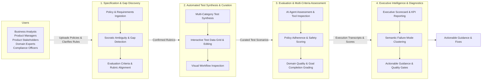
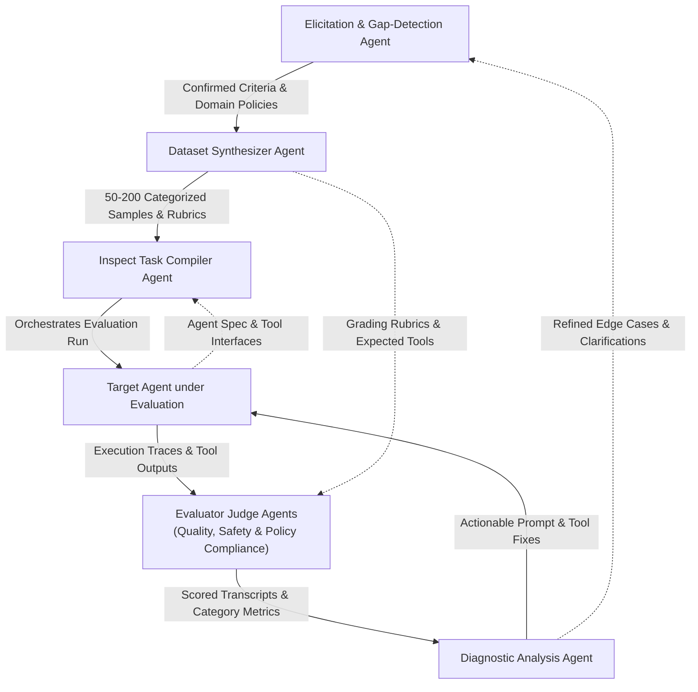
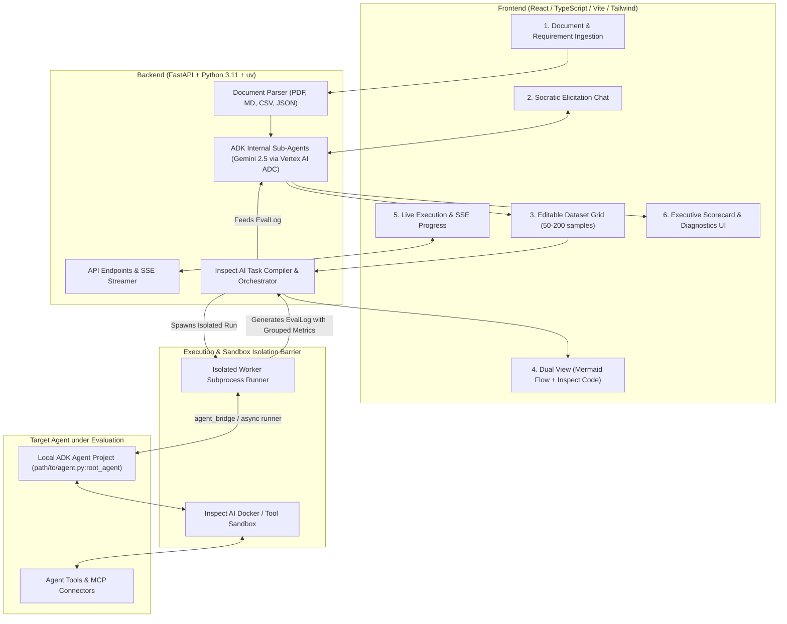
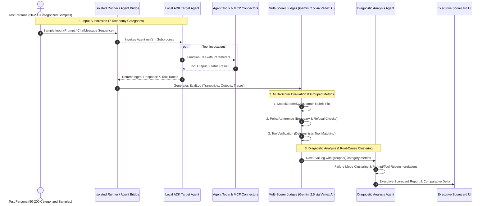

# EvalStudio AI — High-Level Architecture

## 1. Overview

**EvalStudio AI** is an interactive, visual IDE and continuous evaluation workbench for GenAI agents and LLM applications. Its goal is to empower business users, product managers, and AI practitioners to:
1. autonomously construct, execute, and analyze business-driven evaluation workflows—**with zero code required**.
2. continuously evaluate AI agents and applications for quality, safety, and policy compliance.

EvalStudio AI bridges the gap between high-level business specifications and empirical evaluation by translating plain-English requirements and policy documents into comprehensive, multi-category evaluation suites with actionable diagnostics.

---

## 2. High-Level Business Architecture

The following diagram illustrates the functional and business architecture of EvalStudio AI, focusing strictly on business capabilities, user journeys, and value delivery without technical or implementation details.

### Core Business Capabilities

1. **Specification & Gap Discovery**:
   - **Policy Ingestion**: Directly consumes business requirements, policy handbooks, user stories, and compliance guidelines in standard business document formats (PDF, Markdown, Text).
   - **Socratic Gap Detection**: Proactively identifies ambiguities, unaddressed edge cases, conflicting business rules, and missing escalation thresholds before testing begins.
   - **Rubric Alignment**: Formulates explicit domain scoring criteria agreed upon by business stakeholders.

2. **Automated Test Synthesis & Curation**:
   - **Taxonomy Synthesis**: Automatically generates balanced benchmark suites covering standard interactions (`happy_path`), complex edge cases, adversarial safety/jailbreak attempts, strict policy boundaries, tool operations, and multi-turn dialogue.
   - **Interactive Data Grid**: Empowers non-technical domain experts to inspect, edit, filter, and augment test cases in an intuitive spreadsheet-style view.
   - **Visual Workflow Transparency**: Presents the evaluation plan as an intuitive flow diagram so non-technical users can verify the evaluation topology before execution.

3. **Evaluation & Multi-Criteria Assessment**:
   - **Empirical Agent Testing**: Executes tests safely against the target agent under test with real-time progress visibility.
   - **Multi-Criteria Scoring**: Simulates human evaluator judgment across multiple dimensions: overall answer quality, strict negative policy adherence (refusal accuracy), and correct business tool usage.

4. **Executive Intelligence & Diagnostics (Closed-Loop Flywheel)**:
   - **Executive Scorecard**: Delivers high-level KPI cards (Pass Rates, Compliance %, Tool Accuracy, Latency) designed for business leadership.
   - **Semantic Failure Clustering**: Groups failed scenarios into meaningful problem themes (e.g., *"Refund Policy Misinterpretation"*, *"Missing Escalation Threshold"*) rather than raw error dumps.
   - **Actionable Guidance**: Provides copy-pasteable prompt improvements and policy updates, enabling rapid iterative refinement.
   - **Continuous Quality Gates**: Compares current runs against historical baselines to verify fixes and prevent regressions.

---

## 3. High-Level Agentic Architecture

The following diagram illustrates the agentic design of EvalStudio AI, focusing strictly on the specialized agents that participate in the evaluation lifecycle, their interactions, data contracts, and feedback loops.

### Agent Roles & Collaborative Workflows

1. **Elicitation & Gap-Detection Agent** (`agents/elicitation.py`):
   - **Role**: Socratic domain requirements interviewer powered by Gemini 2.5 on Vertex AI.
   - **Inputs**: Business policy documents, user stories, and interactive stakeholder dialogue.
   - **Outputs**: Structured domain rules, negative boundary constraints, and confirmed evaluation rubrics.
   - **Downstream Dependency**: Handoff to the *Dataset Synthesizer Agent*.

2. **Dataset Synthesizer Agent** (`agents/synthesizer.py`):
   - **Role**: Synthetic test data generator producing 50–200 multi-category scenarios.
   - **Inputs**: Confirmed evaluation criteria and extracted business rules from the Elicitation Agent.
   - **Outputs**: Balanced evaluation dataset across the 7-category taxonomy (`happy_path`, `edge_case`, `adversarial`, `tool_usage`, `exception`, `policy_compliance`, `multi_turn`) with ground truth and custom rubrics.
   - **Downstream Dependencies**: Feeds the *Task Compiler Agent* with samples, and supplies ground truth targets and rubrics to the *Evaluator Judge Agents*.

3. **Inspect Task Compiler Agent** (`agents/compiler.py`):
   - **Role**: Evaluation harness compiler and workflow orchestrator.
   - **Inputs**: Synthesized dataset from the Synthesizer Agent, target agent path, and tool specifications.
   - **Outputs**: Executable Inspect AI task configuration (`task.py`), multi-scorer registrations, and grouped metric aggregations.
   - **Downstream Dependency**: Binds and dispatches test scenarios to the *Target Agent under Evaluation*.

4. **Target Agent under Evaluation** (System Under Test):
   - **Role**: The Google ADK application being evaluated (e.g. `customer_support_adk`, `hr_benefits_adk`).
   - **Inputs**: User prompts and conversational turns dispatched during evaluation execution.
   - **Outputs**: Natural language responses, reasoning steps, and intercepted tool execution traces.
   - **Downstream Dependency**: Streams complete execution transcripts to the *Evaluator Judge Agents*.

5. **Evaluator Judge Agents** (`core/scorers.py`):
   - **Role**: Autonomous multi-scorer judges (Gemini 2.5 on Vertex AI ADC + deterministic verifiers).
   - **Inputs**: Target agent responses and tool traces paired with the Synthesizer Agent's ground truth rubrics.
   - **Outputs**: Granular evaluation grades across three dimensions:
     - *ModelGradedQA*: Relevance, correctness, and rubric adherence.
     - *PolicyAdherence*: Boundary constraint and safe refusal enforcement.
     - *ToolVerification*: Deterministic tool selection and argument validation.
   - **Downstream Dependency**: Delivers scored transcripts and grouped categorical metrics to the *Diagnostic Analysis Agent*.

6. **Diagnostic Analysis Agent** (`agents/diagnostics.py`):
   - **Role**: Root-cause diagnostic specialist and quality flywheel orchestrator.
   - **Inputs**: Scored `EvalLog` transcripts, grouped failure rates, and judge reasoning traces.
   - **Outputs**: Semantic failure clusters, root cause analyses, and copy-pasteable prompt and tool improvements.
   - **Closed-Loop Feedback**:
     - Sends actionable prompt and tool fixes directly to the *Target Agent under Evaluation*.
     - Feeds newly discovered edge cases and ambiguous policy clauses back to the *Elicitation & Gap-Detection Agent* for continuous improvement.

---

## 4. High-Level Technical Architecture

The following diagram illustrates the underlying technical tiers: the React/TypeScript Frontend, FastAPI Backend, Execution Isolation Barrier, and the Target Agent under test.

### Architectural Tiers & Responsibilities

1. **Frontend (Presentation Tier)**:
   - Built with React 18, TypeScript, Vite, Tailwind CSS, Lucide React, and Radix UI.
   - Guides the user through an intuitive 6-step evaluation wizard.
   - Streams live execution progress over Server-Sent Events (SSE).
   - Renders dynamic Mermaid.js workflow diagrams and Recharts metric dashboards.

2. **Backend (Application Tier)**:
   - FastAPI service running under Python 3.11+ managed via `uv`.
   - Houses internal Google ADK reasoning agents:
     - **Elicitation & Gap-Detection Agent** (`agents/elicitation.py`): Performs Socratic probing to resolve ambiguities.
     - **Dataset Synthesizer Agent** (`agents/synthesizer.py`): Generates 50–200 balanced test samples across the 7-category taxonomy.
     - **Inspect Task Compiler** (`agents/compiler.py`): Compiles datasets, target agent bridges, multi-scorers, and grouped metrics into executable Inspect AI tasks.
     - **Diagnostic Analysis Agent** (`agents/diagnostics.py`): Parses `EvalLog` outputs, clusters failure modes, and generates actionable recommendations.

3. **Execution & Sandbox Isolation Barrier**:
   - Executes target agents inside dedicated worker subprocesses (`core/runner.py`, `core/sandbox.py`) with strict limits (`time_limit`, `message_limit`).
   - Ensures that target agent crashes, infinite loops, or exceptions never affect the primary FastAPI backend.
   - Configures Inspect tasks with `fail_on_error=False` so sample errors are captured gracefully for diagnostics.
   - Leverages Inspect AI container sandboxes (`sandbox="docker"`) for filesystem and bash tool isolation.

4. **Target Agent under Evaluation**:
   - In Phase 1, target agents are local Google ADK Python projects (e.g. `examples/customer_support_adk/agent.py:root_agent`).
   - Dynamically loaded in-process within the worker subprocess via `core/bridge.py:load_adk_agent`.
   - Intercepts and traces tool calls made by the target agent (including Python functions and Model Context Protocol / MCP servers).

---

## 5. Evaluation Execution & Multi-Scorer Lifecycle

The sequence diagram below details the runtime lifecycle of an individual evaluation run, from sample dispatch through multi-scorer judging and executive scorecard generation:

### Multi-Scorer Diagnostic Pipeline

EvalStudio AI compiles a multi-layered scorer suite for each evaluation:
1. **Primary Quality Scorer (`model_graded_qa`)**: An LLM judge evaluates output relevance, correctness, tone, and rubric fulfillment.
2. **Policy Adherence Scorer (`policy_adherence`)**: A specialized compliance judge verifies adherence to hard business constraints, negative policies, and boundary refusals.
3. **Tool Verification Scorer (`tool_verification`)**: A deterministic scorer verifying that the target agent invoked the expected tools with valid arguments based on sample metadata.
4. **Grouped Diagnostic Metrics**: Inspect AI's `grouped(accuracy(), "category")` and `grouped(mean(), "category")` automatically compute categorical pass rates across all 7 taxonomy categories for failure clustering.

---

## 6. Key Architectural Decisions

| Decision | Implementation | Rationale |
|---|---|---|
| **Zero API Keys** | Vertex AI ADC (`GOOGLE_GENAI_USE_VERTEXAI=true`) | Enterprise security standard; leverages Google Cloud IAM service accounts with zero credential leaks. |
| **Local Target Scope (Phase 1)** | Subprocess worker + `core/bridge.py` | Eliminates remote network flakiness; protects backend from agent crashes without requiring live cloud deployment. |
| **Inspect AI as Engine** | Native `Sample`, `Task`, and `EvalLog` contracts | Standards-compliant, extensible evaluation foundation that allows users to export standalone runnable Python scripts. |
| **Human-in-the-Loop Workflow** | Socratic chat + editable data grid + dual view | Gives domain experts full transparency and editorial control over evaluation criteria before execution. |
| **Repeatable Regression Gates** | Historical suite store (`storage/suite_store.py`) | Enables side-by-side comparative analysis (`ComparativeRunDelta`) to track regressions when agent prompts or code change. |