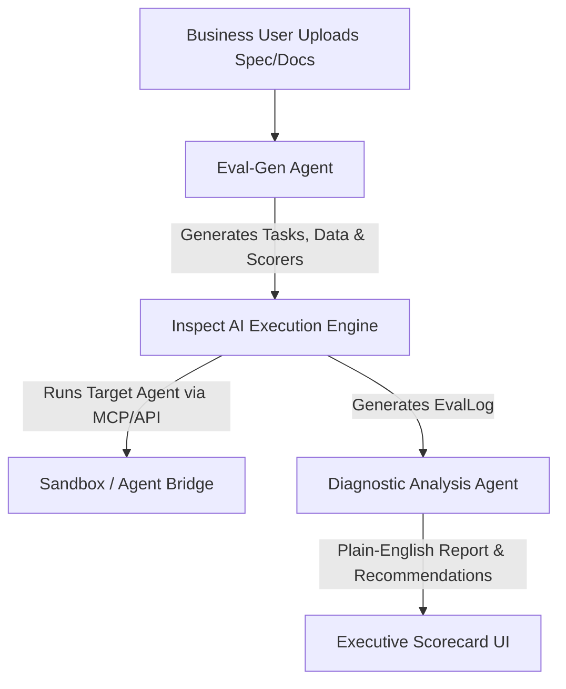
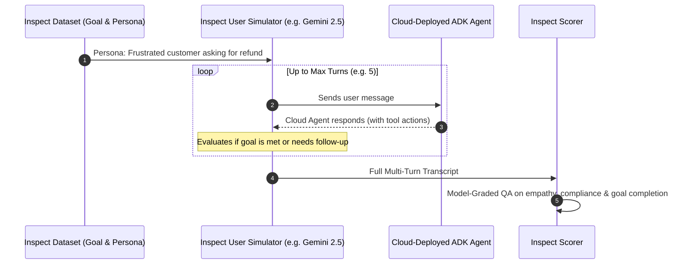

# Mermaid Example

This document contains mermaid diagrams.

```mermaid
flowchart TD
    A["Business User Uploads Spec/Docs"] --> B["Eval-Gen Agent"]
    B -->|"Generates Tasks, Data & Scorers"| C["Inspect AI Execution Engine"]
    C -->|"Runs Target Agent via MCP/API"| D["Sandbox / Agent Bridge"]
    C -->|"Generates EvalLog"| E["Diagnostic Analysis Agent"]
    E -->|"Plain-English Report & Recommendations"| F["Executive Scorecard UI"]
```

## Multi-Turn Dynamic Customer Simulation

```mermaid
sequenceDiagram
    autonumber
    participant D as Inspect Dataset (Goal & Persona)
    participant Sim as Inspect User Simulator (e.g. Gemini 2.5)
    participant ADK as Cloud-Deployed ADK Agent
    participant S as Inspect Scorer
    D->>Sim: Persona: Frustrated customer asking for refund
    loop Up to Max Turns (e.g. 5)
        Sim->>ADK: Sends user message
        ADK-->>Sim: Cloud Agent responds (with tool actions)
        Note over Sim: Evaluates if goal is met or needs follow-up
    end
    Sim->>S: Full Multi-Turn Transcript
    S->>S: Model-Graded QA on empathy, compliance & goal completion
```