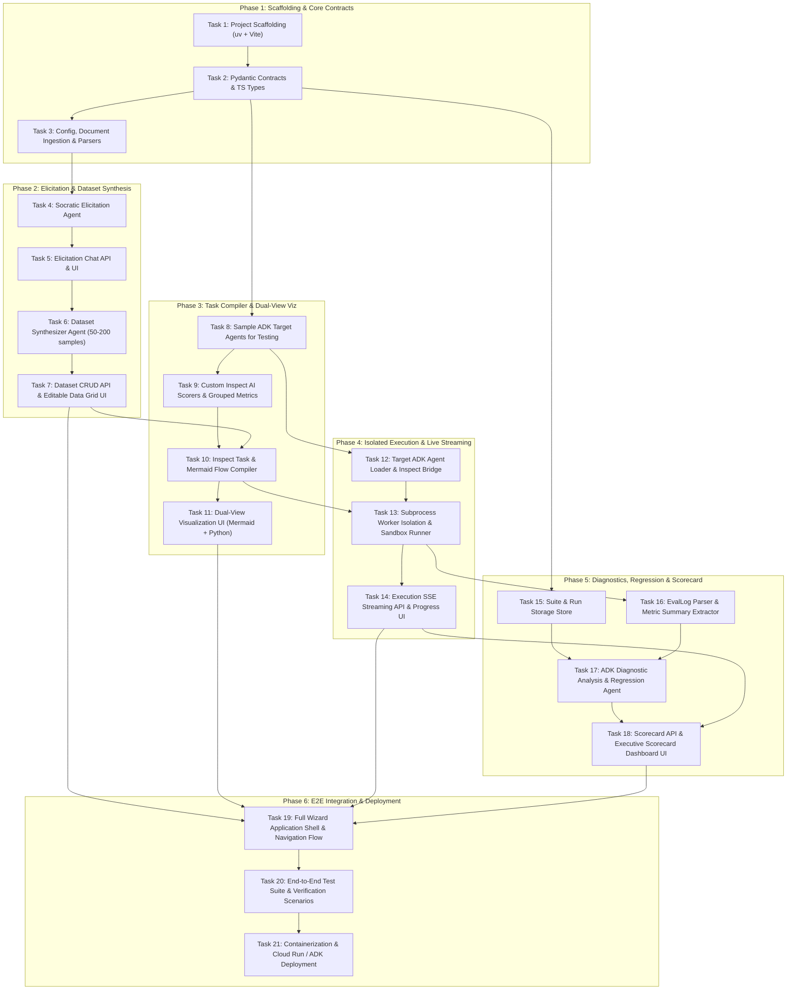

# Implementation Plan: EvalStudio AI (Phase 1)

## Overview
**EvalStudio AI** is an agentic web application empowering business users, product managers, and AI practitioners to autonomously construct, execute, and analyze business-driven evaluation workflows for GenAI agents with zero code required. It features interactive Socratic requirement elicitation, automated 50–200 multi-category dataset synthesis (matching Inspect AI `Sample` schema), dynamic Inspect AI task compilation with proactive grouped diagnostic scorers, isolated subprocess and sandbox runner execution against local Google Agent Development Kit (ADK) agent projects, persistent evaluation suites and historical run logs for repeatable regression testing, and an automated diagnostic analysis agent that generates an Executive Scorecard with comparative regression deltas, semantic failure clusters, and copy-pasteable prompt/tool recommendations.

---

## Architecture Decisions

1. **Package & Virtual Environment Management with `uv`**:
   * Use `uv` with `pyproject.toml` for ultra-fast, reproducible dependency management and deterministic virtual environments across backend services, workers, and test runners.

2. **Strict Vertex AI Application Default Credentials (ADC) Authentication**:
   * All Google Gemini 2.5 Pro / Flash LLM calls through Google ADK (`google-agents`) and Google GenAI SDK strictly authenticate using GCP ADC (`GOOGLE_GENAI_USE_VERTEXAI=true`, `GOOGLE_CLOUD_PROJECT`, `GOOGLE_CLOUD_LOCATION`). **Zero API keys are used in codebase or runtime.**

3. **Inspect AI as the Native Execution & Diagnostic Harness**:
   * Full fidelity to Inspect AI's native data model: datasets leverage `inspect_ai.dataset.Sample` schemas (`id`, `input`, `target`, `metadata`), tasks compile with multi-scorers (`model_graded_qa`, policy compliance, tool verification) and `grouped()` metrics (`grouped(accuracy(), "category")`, `grouped(mean(), "category")`, `stderr()`, `ci()`), producing standard `EvalLog` artifacts.

4. **Multi-Tier Execution Isolation & Fault Tolerance**:
   * Target agents run inside isolated worker subprocesses and optional Docker container sandboxes, ensuring target crashes, memory leaks, or unhandled exceptions never affect the FastAPI backend. Inspect `Task` is configured with `fail_on_error=False` to ensure partial failures are recorded as sample errors for diagnostic analysis rather than crashing the evaluation run.

5. **Repeatable Evaluation & Historical Suite Storage**:
   * Evaluation suites, datasets, task definitions, and run histories are persisted via a lightweight local JSON/SQLite store (`storage/suite_store.py`), enabling one-click re-evaluation and side-by-side comparative regression analysis when target agent code or prompts are updated.

6. **Single-Page Wizard Frontend with Real-Time SSE Streaming**:
   * Built with React 18, TypeScript, Vite, Tailwind CSS, Lucide React, and Radix UI. Real-time execution feedback is streamed via Server-Sent Events (SSE). Dynamic visualizations leverage Mermaid.js for business workflow sequence/flow diagrams and Recharts for metric dashboards.

7. **Dual-View Task Presentation**:
   * Primary view presents a high-level business sequence/flowchart diagram in Mermaid.js (Persona → Target Agent → Tools → Evaluator Judge); secondary expandable view displays the pure runnable Inspect AI Python task script.

---

## Dependency Graph

---

## Phased Implementation Plan

All task specifications, explicit acceptance criteria, verification commands, and file lists are recorded in [`tasks/todo.md`](file:///usr/local/google/home/gkanevsky/projects/eval-studio-ai/tasks/todo.md).

### Phase 1: Foundation & Core Contracts
* [ ] **Task 1**: Environment & Project Scaffolding (`pyproject.toml`, `uv.lock`, FastAPI base app, React/Vite/Tailwind setup)
* [ ] **Task 2**: Core Data Contracts & Schemas (`models/dataset.py`, `models/elicitation.py`, `models/task.py`, `models/scorecard.py` & TS types)
* [ ] **Task 3**: Config, Document Parsers & Ingestion API (`config.py`, `utils/pdf_parser.py`, `routers/ingest.py`, `components/ingest/`)

#### Checkpoint 1: Foundation & Ingestion Verified
* [ ] Backend initializes cleanly with `uv run uvicorn app.main:app`
* [ ] Document ingestion endpoint parses PDF/Markdown/Text and returns structured text
* [ ] TypeScript types compile without errors (`npm run build`)

---

### Phase 2: Socratic Elicitation & Multi-Category Dataset Synthesis
* [ ] **Task 4**: Socratic Elicitation & Gap-Detection Agent (`agents/elicitation.py`, Vertex AI ADC)
* [ ] **Task 5**: Interactive Elicitation Chat API & UI (`routers/ingest.py`, `components/chat/ChatInterface.tsx`)
* [ ] **Task 6**: Multi-Category Dataset Synthesizer Agent for 50–200 Categorized Samples (`agents/synthesizer.py`)
* [ ] **Task 7**: Dataset Management API & Interactive Editable Data Grid UI (`routers/dataset.py`, `components/dataset/DatasetGrid.tsx`)

#### Checkpoint 2: Elicitation & Dataset Grid Verified
* [ ] Elicitation agent identifies policy ambiguities via Socratic probing and interacts via chat
* [ ] Synthesizer generates 50–200 samples matching all 7 taxonomy categories with rubrics
* [ ] Frontend data grid renders samples with category filtering, inline editing, and sample inspection

---

### Phase 3: Inspect AI Task Compilation & Dual-View Visualization
* [ ] **Task 8**: Sample Target ADK Agents for Evaluation & Testing (`examples/customer_support_adk/`, `examples/hr_benefits_adk/`)
* [ ] **Task 9**: Custom Inspect AI Scorers & Grouped Metric Helpers (`core/scorers.py`)
* [ ] **Task 10**: Inspect AI Task & Mermaid Diagram Compiler (`agents/compiler.py`, `utils/code_generator.py`)
* [ ] **Task 11**: Dual-View Task Presentation UI (`components/visualization/DualView.tsx`, Mermaid + Python syntax highlighter)

#### Checkpoint 3: Task Compiler & Dual-View UI Verified
* [ ] Task compiler outputs syntactically valid Python code runnable via `inspect eval`
* [ ] Multi-scorers (model-graded, policy, tool verification) and `grouped()` metrics registered properly
* [ ] Mermaid sequence/flow diagram and Python code render cleanly in split UI

---

### Phase 4: Isolated Execution Engine & Live Streaming
* [ ] **Task 12**: Target ADK Agent Loader & Inspect Bridge (`core/bridge.py`)
* [ ] **Task 13**: Subprocess Worker Isolation & Sandbox Execution Runner (`core/sandbox.py`, `core/runner.py`)
* [ ] **Task 14**: Real-Time SSE Execution Stream API & Live Progress UI (`routers/evaluate.py`, `components/execution/LiveProgress.tsx`, `hooks/useEvalStream.ts`)

#### Checkpoint 4: Isolated Execution & Live Streaming Verified
* [ ] Target agent execution runs in a separated worker process without blocking/crashing FastAPI
* [ ] Target agent crash or tool exception fails at sample level with `fail_on_error=False` and streams error to UI
* [ ] Real-time SSE updates progress bar, current sample status, and live execution logs

---

### Phase 5: Diagnostic Analysis, Regression Quality Gates & Executive Scorecard
* [ ] **Task 15**: Suite & Run Storage Store for Repeatable Evals (`storage/suite_store.py`)
* [ ] **Task 16**: Inspect `EvalLog` Parser & Metric Summary Extractor (`core/log_parser.py`)
* [ ] **Task 17**: ADK Diagnostic Analysis Agent & Comparative Regression Engine (`agents/diagnostics.py`)
* [ ] **Task 18**: Scorecard API & Executive Scorecard Dashboard UI (`routers/scorecard.py`, `components/scorecard/ScorecardDashboard.tsx`, `components/scorecard/SampleInspectorModal.tsx`)

#### Checkpoint 5: Diagnostic Analysis & Scorecard Verified
* [ ] `EvalLog` is parsed into structured KPI summaries and category metrics
* [ ] Suite storage persists evaluation suites and historical run logs for comparison
* [ ] Diagnostic agent clusters sample failures by root cause, computes `ComparativeRunDelta` against baseline, and produces actionable prompt/tool fixes
* [ ] Executive Scorecard displays KPI cards, Recharts breakdown, regression deltas, failure cluster cards, and full sample trace modal

---

### Phase 6: Wizard UI Integration, End-to-End Verification & Deployment
* [ ] **Task 19**: Full Wizard Application Shell & Navigation Flow (`frontend/src/App.tsx`, `components/layout/Header.tsx`, `components/layout/StepNavigator.tsx`)
* [ ] **Task 20**: End-to-End Integration Test Suite & Automated Evaluation Scenarios (`tests/test_e2e.py`, `tests/test_sandbox_isolation.py`)
* [ ] **Task 21**: Containerization & Google Cloud Deployment Artifacts (`Dockerfile`, `docker-compose.yaml`, `agents-cli deploy` setup)

#### Checkpoint 6: Full System Verification & Deployment Ready
* [ ] Complete end-to-end evaluation scenario passes from PDF ingestion to Scorecard in < 10 minutes
* [ ] Backend unit/integration tests pass with pytest: `uv run pytest tests/ -v`
* [ ] Full stack runs locally via `docker compose up --build`
* [ ] Ready for deployment via `agents-cli deploy` and Google Cloud Run

---

## Risks and Mitigations

| Risk | Impact | Mitigation |
|---|---|---|
| **Target agent crash or memory leak crashes backend** | High | Run evaluation execution in an isolated subprocess worker with process timeouts; configure Inspect tasks with `fail_on_error=False`. |
| **GCP ADC authentication issues during local or cloud runs** | High | Centralize configuration in `config.py` using `google-genai` and `VertexAI` provider with `GOOGLE_GENAI_USE_VERTEXAI=true`. Explicitly check credentials on startup with clear diagnostic error messages. |
| **Inspect AI compatibility drift with ADK agent models** | Medium | Implement clean wrapper bridge (`core/bridge.py`) that abstracts ADK agent calls into Inspect solver interfaces and captures raw tool calls. |
| **High latency generating 50–200 samples via LLM** | Medium | Use Gemini 2.5 Flash with batch/concurrent generation and category-specific synthesis prompts to generate test cases rapidly and reliably. |
| **Mermaid diagram rendering errors on complex flows** | Low | Provide sanitized Mermaid generation templates with fallback error boundaries and raw script view in UI. |

---

## Open Questions & Future Considerations
* **Q1**: How are evaluation suites persisted and compared?
  * *Resolution for Phase 1*: Local JSON/SQLite storage in `backend/app/storage/suite_store.py` tracking `suite_id`, dataset snapshots, and `eval_id` historical runs.
* **Q2**: Should custom tool mocks be injected dynamically during evaluation execution?
  * *Resolution for Phase 1*: Use ADK agent's local tools and Inspect AI's container/sandbox filesystem provisioning (`Sample.files`).
