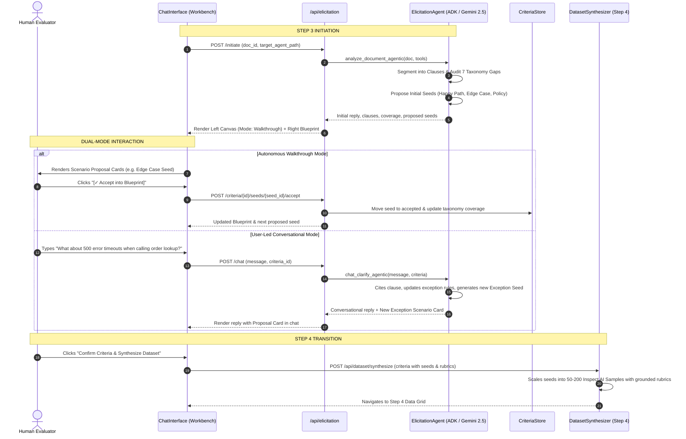

# Spec: Socratic Agentic Elicitation Harness (Step 3 Enhancement)

## 1. Objective

Transform the Step 3 **Socratic Chat Assistant** from a basic single-turn chatbot into a **specialized, dual-mode agentic elicitation harness**. The harness leverages rich document context from Step 2 ("Ingest Spec") and target agent tool specifications to proactively deduce, interrogate, and distill formal evaluation criteria, category seeds, and grading rubrics across the 7 Inspect AI evaluation dimensions (`happy_path`, `edge_case`, `adversarial`, `tool_usage`, `exception`, `policy_compliance`, `multi_turn`).

The distilled output is an **Evaluation Blueprint** that directly primes the Step 4 **Dataset Generation Agent**, enabling it to synthesize 50–200 high-fidelity, grounded test samples without hallucinating rules or relying on generic fallback templates.

### User Stories & Core Capabilities
1. **Document-Grounded Elicitation**: As an evaluator, when I upload a policy/spec document, the Socratic assistant should segment it into citeable clauses and anchor all questions, edge cases, and test scenarios back to specific clauses.
2. **Dual-Mode Probing**:
   - **Autonomous Walkthrough Mode**: The assistant automatically audits coverage across the 7 Inspect AI taxonomy dimensions, identifies unaddressed clauses or gaps, and presents targeted **Scenario Proposal Cards** category by category.
   - **Interactive User-Led Mode**: At any time, I can ask open-ended questions, clarify domain constraints, or request deep dives into specific topics (e.g., "Let's focus on adversarial prompt injection").
3. **Structured Scenario Proposal Cards**: Rather than reading long conversational walls of text, I can review structured test seeds (user input, expected target, model-graded rubric, expected tool call) with 1-click `Accept into Blueprint`, `Tweak`, or `Dismiss`.
4. **Live Split-Screen Workbench**:
   - **Left Pane (Active Canvas)**: Interactive Socratic Chat, mode toggles, and actionable Scenario Proposal Cards.
   - **Right Pane (Live Evaluation Blueprint)**: Categorized criteria tabbed across the 7 taxonomy dimensions, showing confirmed rules, distilled test seeds, expected tools, and a real-time **Taxonomy Coverage Gauge**.
5. **Seamless Distillation for Step 4**: The distilled blueprint provides high-quality exemplars and precise boundary parameters so the Step 4 Synthesizer produces diverse, policy-grounded test suites.

---

## 2. Tech Stack

| Layer | Technology | Version / Requirement | Rationale |
|---|---|---|---|
| **Language & Env** | Python 3.11+, `uv` | Modern Python with fast dependency management | Consistent with EvalStudio AI backend standards |
| **Backend Framework** | FastAPI + Pydantic v2 | `fastapi >= 0.110.0`, `pydantic >= 2.6.0` | High-performance async API with strict schema validation |
| **Agent Intelligence** | Google ADK / Gemini 2.5 Pro & Flash via Vertex AI | Vertex AI ADC (`GOOGLE_GENAI_USE_VERTEXAI=true`) | State-of-the-art Socratic reasoning, clause analysis, and zero API key credentials |
| **Evaluation Framework** | Inspect AI | `inspect-ai >= 0.3.50` | 7-category evaluation taxonomy alignment (`Sample` schema compatibility) |
| **Frontend Framework** | React 18 + TypeScript + Vite | TypeScript 5.x, Vite 5.x | Fast, type-safe single-page application |
| **UI Styling & Icons** | Tailwind CSS + Lucide React + Radix UI | Tailwind 3.4+, Lucide React | Matches EvalStudio AI dark theme design system |

---

## 3. Commands

```bash
# 1. Backend Development Server
cd backend
uv run uvicorn app.main:app --reload --port 8000

# 2. Backend Unit & Integration Tests
cd backend
uv run pytest tests/test_elicitation.py tests/test_synthesizer.py -v

# 3. Frontend Development Server
cd frontend
npm run dev

# 4. Frontend Type Checking & Build
cd frontend
npm run build
npm run test
```

---

## 4. Project Structure & File Changes

```
eval-studio-ai/
├── backend/
│   ├── app/
│   │   ├── models/
│   │   │   └── elicitation.py       # [MODIFY] Enriched data contracts: EvaluationSeed, ClauseReference,
│   │   │                            #          TaxonomyCoverage, and upgraded ConfirmedCriteriaModel
│   │   │
│   │   ├── agents/
│   │   │   ├── elicitation.py       # [MODIFY] SocraticAgenticHarness: clause segmenter, 7-category auditor,
│   │   │   │                        #          dual-mode coordinator, scenario generator, and chat clarify
│   │   │   └── synthesizer.py       # [MODIFY] Enhance DatasetSynthesizer to consume rich seeds & rubrics
│   │   │
│   │   └── routers/
│   │       └── elicitation.py       # [MODIFY] Endpoints for scenario seed acceptance, taxonomy coverage,
│   │                                #          and deep-dive category probing
│   │
│   └── tests/
│       ├── test_elicitation.py      # [MODIFY] Tests for dual-mode, scenario cards, clause grounding, and coverage
│       └── test_synthesizer.py      # [MODIFY] Verify synthesizer leverages distilled seeds
│
└── frontend/
    └── src/
        ├── types/
        │   └── index.ts             # [MODIFY] TypeScript interfaces for EvaluationSeed, TaxonomyCoverage, etc.
        ├── services/
        │   └── api.ts               # [MODIFY] API methods for scenario card actions & deep-dive triggers
        └── components/
            └── chat/
                ├── ChatInterface.tsx         # [MODIFY] Split-screen workbench with dual-mode canvas & live blueprint
                ├── ScenarioProposalCard.tsx  # [NEW] Interactive card with 1-click Accept / Edit / Dismiss
                └── TaxonomyCoverageMeter.tsx # [NEW] Visual 7-category coverage bar with progress indicator
```

---

## 5. Data Contracts & Architecture

### 5.1 Enriched Elicitation Schemas (`backend/app/models/elicitation.py`)

```python
from typing import Dict, List, Literal, Optional, Any
from pydantic import BaseModel, Field

EvalCategory = Literal[
    "happy_path",
    "edge_case",
    "adversarial",
    "tool_usage",
    "exception",
    "policy_compliance",
    "multi_turn"
]

class ClauseReference(BaseModel):
    clause_id: str = Field(..., description="Unique clause/section ID (e.g. SEC-01)")
    heading: str = Field(..., description="Section title")
    text_snippet: str = Field(..., description="Key policy excerpt or rule")

class EvaluationSeed(BaseModel):
    seed_id: str = Field(..., description="Unique seed identifier (e.g. seed-hp-01)")
    category: EvalCategory = Field(..., description="One of the 7 Inspect AI categories")
    source_clause_id: Optional[str] = Field(default=None, description="Referenced clause ID")
    scenario_intent: str = Field(..., description="Brief summary of test condition")
    sample_input: str = Field(..., description="Concrete user query or multi-turn prompt")
    expected_target: str = Field(..., description="Ideal ground truth agent behavior / refusal")
    grading_rubric: str = Field(..., description="Pass/fail criteria for model-graded judge")
    expected_tools: List[str] = Field(default_factory=list, description="Expected tools to invoke")
    difficulty: Literal["easy", "medium", "hard"] = "medium"
    status: Literal["proposed", "accepted", "dismissed"] = "proposed"

class TaxonomyCoverage(BaseModel):
    category: EvalCategory
    target_count: int = 3
    accepted_count: int = 0
    coverage_score: float = 0.0  # 0.0 to 1.0
    status: Literal["gap", "partial", "complete"] = "gap"

class ConfirmedCriteriaModel(BaseModel):
    criteria_id: str = Field(default="crit-default")
    use_case: str
    target_agent_description: str = ""
    target_agent_path: str = "examples/customer_support_adk/agent.py:root_agent"
    domain_rules: List[str] = Field(default_factory=list)
    edge_cases: List[str] = Field(default_factory=list)
    safety_policies: List[str] = Field(default_factory=list)
    expected_tools: List[str] = Field(default_factory=list)
    clauses: List[ClauseReference] = Field(default_factory=list)
    ambiguities: List[Any] = Field(default_factory=list)
    test_seeds: List[EvaluationSeed] = Field(default_factory=list)
    taxonomy_coverage: Dict[str, float] = Field(default_factory=dict)
    evaluation_rubrics: Dict[str, str] = Field(default_factory=dict)
    is_confirmed: bool = False
```

### 5.2 Agentic Harness Workflow & Reasoning Loop



---

## 6. UI & Visual Specifications (Split-Screen Workbench)

### Left Pane (7 Columns, ~58% width): Active Work Canvas
- **Header Bar**:
  - Mode Switcher Toggle:
    - `[⚡ Autonomous Walkthrough]` (Audits 7 categories sequentially, proposing scenario seeds).
    - `[💬 Socratic Chat]` (Conversational exploration and free-form Q&A).
    - `[⚠️ Detected Gaps]` (Quick resolution of flagged policy ambiguities).
  - Target Agent Indicator with Tool Chips.
- **Feed Area**:
  - Conversational messages with Bot / User avatars.
  - **Scenario Proposal Cards**:
    - Header with Category badge (color-coded: emerald for `happy_path`, amber for `edge_case`, purple for `adversarial`, sky for `tool_usage`, rose for `policy_compliance`, orange for `exception`, indigo for `multi_turn`).
    - Source Clause citation tag (e.g. `§ Clause 2.1: Hygiene Exceptions`).
    - Input prompt snippet & Expected target resolution.
    - Model-graded judge rubric snippet.
    - Expected tool invocation (with parameters).
    - Action buttons: `[✓ Accept into Blueprint]`, `[✎ Edit Seed]`, `[✕ Dismiss]`.
- **Bottom Input Bar**:
  - Quick action chips: `[Deep-Dive: Adversarial Attacks]`, `[Deep-Dive: Tool Exceptions]`, `[Suggest Multi-Turn Flow]`.
  - Rich chat input with enter-to-send and loading indicator.

### Right Pane (5 Columns, ~42% width): Live Evaluation Blueprint
- **Header**: "Live Evaluation Blueprint" with total seeds count and confirmed criteria count.
- **Taxonomy Coverage Gauge**:
  - Interactive 7-segment coverage bar showing percentage readiness across all 7 categories (`happy_path`, `edge_case`, `adversarial`, `tool_usage`, `exception`, `policy_compliance`, `multi_turn`).
- **Category Tabs**:
  - Filter confirmed rules and accepted seeds by category.
- **Confirmed Test Seeds & Rules List**:
  - Editable cards showing accepted test seeds that will directly feed Step 4.
  - Full CRUD: Add manual seed, edit existing, delete.
- **Bottom Synthesis CTA**:
  - Dynamic button: `Confirm Blueprint & Synthesize Dataset (50-200 Samples) ->`
  - Subtitle showing coverage readiness: *"6 of 7 categories covered with high-fidelity seeds."*

---

## 7. Boundaries

### Always Do
- Authenticate all Gemini 2.5 calls via Google Cloud Application Default Credentials (ADC) with Vertex AI (`GOOGLE_GENAI_USE_VERTEXAI=true`).
- Ground every proposed scenario seed and rule in an identifiable section/clause of the ingested document whenever present.
- Maintain full backward compatibility with the existing Step 4 [`DatasetSynthesizerAgent`](file:///usr/local/google/home/gkanevsky/projects/eval-studio-ai/backend/app/agents/synthesizer.py) and Inspect AI `Sample` contract.
- Provide deterministic offline fallback implementations so unit tests and offline environments operate reliably without network or ADC errors.

### Ask First
- Adding new categories outside the 7 Inspect AI taxonomy dimensions.
- Changing root API endpoint URLs (`/api/elicitation/*`).

### Never Do
- Never hardcode API keys, GCP credentials, or project IDs in code.
- Never clear existing confirmed criteria or seeds when a user asks a general question.
- Never block the user from proceeding to Step 4 if they choose to synthesize before all 7 categories reach 100% coverage.

---

## 8. Success Criteria (Definition of Done)

1. **Document Clause Indexing**: Ingesting a spec (e.g. `ecommerce_refund_policy.md` or PDF) parses the text into distinct clauses displayed and cited in Step 3.
2. **Dual-Mode Operation**:
   - In Autonomous Walkthrough mode, the assistant systematically audits the 7 categories and generates structured `EvaluationSeed` proposal cards.
   - In Chat mode, the user can conduct free-form conversation, ask questions, or request deep dives without losing criteria state.
3. **1-Click Seed Acceptance**: Clicking `[Accept into Blueprint]` immediately moves the proposed seed into the confirmed blueprint, updates the Taxonomy Coverage Gauge in real time, and persists to the backend criteria store.
4. **Enhanced Step 4 Priming**: When proceeding to Step 4, [`DatasetSynthesizerAgent`](file:///usr/local/google/home/gkanevsky/projects/eval-studio-ai/backend/app/agents/synthesizer.py) leverages the distilled seeds and category rubrics to generate 50–200 samples that strictly adhere to the elicited rules and tools.
5. **Robust Testing**: Backend tests pass with `uv run pytest tests/test_elicitation.py tests/test_synthesizer.py -v`. Frontend builds cleanly with zero TypeScript errors (`npm run build`).
