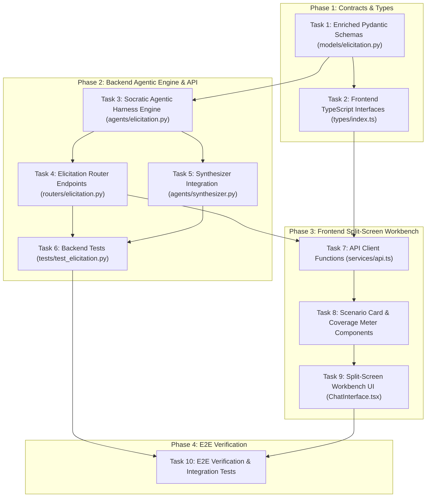

# Implementation Plan: Socratic Agentic Elicitation Harness

## Overview
Transform the Step 3 Socratic Chat Assistant into a specialized dual-mode agentic elicitation harness that ingests spec clauses and tool contracts from Step 2, audits coverage across the 7 Inspect AI taxonomy dimensions (`happy_path`, `edge_case`, `adversarial`, `tool_usage`, `exception`, `policy_compliance`, `multi_turn`), generates actionable Scenario Proposal Cards, and distills a structured Evaluation Blueprint that directly primes the Step 4 Dataset Synthesizer.

---

## Architecture & Dependency Graph

---

## Phased Implementation Steps

### Phase 1: Contracts & Types
- **Task 1**: Enriched Pydantic Schemas (`backend/app/models/elicitation.py`):
  - Add `ClauseReference`, `EvaluationSeed`, `TaxonomyCoverage`.
  - Update `ConfirmedCriteriaModel` with `clauses`, `test_seeds`, `taxonomy_coverage`.
  - Update `InitiateElicitationResponse` and `ElicitationChatResponse` to include proposed seeds and taxonomy coverage.
- **Task 2**: Frontend TypeScript Interfaces (`frontend/src/types/index.ts`):
  - Mirror all backend schemas in TypeScript.

### Phase 2: Backend Agentic Engine & Router
- **Task 3**: Socratic Agentic Harness Engine (`backend/app/agents/elicitation.py`):
  - Segment ingested document text into indexed clauses (`ClauseReference`).
  - Proactively audit gaps against the 7 Inspect AI taxonomy categories.
  - Generate structured `EvaluationSeed` proposal cards with source clause references, expected targets, rubrics, and expected tools.
  - Implement dual-mode behavior: sequential category walkthrough vs open-ended conversational probing.
  - Provide deterministic fallback generators for offline testing.
- **Task 4**: Elicitation Router Endpoints (`backend/app/routers/elicitation.py`):
  - `POST /criteria/{criteria_id}/seeds/{seed_id}/accept`: 1-click accept proposed seed into blueprint.
  - `POST /criteria/{criteria_id}/seeds/{seed_id}/dismiss`: Dismiss proposed seed.
  - `POST /criteria/{criteria_id}/seeds`: Add or edit custom seed in blueprint.
  - `POST /criteria/{criteria_id}/deep-dive`: Trigger category-specific deep dive.
- **Task 5**: Synthesizer Integration (`backend/app/agents/synthesizer.py`):
  - Update `DatasetSynthesizerAgent` to prioritize accepted seeds as few-shot exemplars and boundary specifications for each category when generating the 50–200 samples.
- **Task 6**: Backend Test Suite (`backend/tests/test_elicitation.py`, `tests/test_synthesizer.py`):
  - Validate clause segmentation, taxonomy coverage math, seed acceptance lifecycle, and synthesizer priming.

### Phase 3: Frontend Split-Screen Workbench
- **Task 7**: API Client Methods (`frontend/src/services/api.ts`):
  - Add methods for accepting/dismissing seeds, deep-dive triggers, and manual seed CRUD.
- **Task 8**: Scenario Proposal Card & Taxonomy Coverage Meter Components:
  - Create `ScenarioProposalCard.tsx` with color-coded categories, clause tags, and 1-click actions.
  - Create `TaxonomyCoverageMeter.tsx` with 7-category progress indicators.
- **Task 9**: Split-Screen Workbench UI (`frontend/src/components/chat/ChatInterface.tsx`):
  - Left pane: Dual-mode canvas (Walkthrough vs Chat vs Gaps), displaying conversation history and rich proposal cards.
  - Right pane: Live Evaluation Blueprint with category tabs, confirmed seeds list, manual add/edit modals, and real-time coverage gauge.

### Phase 4: E2E Verification
- **Task 10**: E2E Verification & Integration Check:
  - Test the entire path from Step 2 Ingestion -> Step 3 Dual-Mode Workbench -> Step 4 Primed Dataset Synthesizer.
  - Run `uv run pytest` and `npm run build` to ensure zero regressions.

---

## Risks and Mitigations

| Risk | Impact | Mitigation |
|---|---|---|
| **LLM latency when generating initial seeds during initiation** | Medium | Asynchronously stream or generate 2–3 immediate initial seeds for canonical categories (`happy_path`, `edge_case`, `policy_compliance`) and generate additional categories on demand during the walkthrough. |
| **Backward compatibility with existing Step 4 Synthesizer** | High | Keep `ConfirmedCriteriaModel` fields (`domain_rules`, `edge_cases`, `safety_policies`, `expected_tools`) intact and sync accepted seeds with domain rules so legacy paths still function. |
| **Offline / Test environment stability** | Medium | Maintain deterministic fallback generation in `_fallback_analyze_document` and `_fallback_chat_clarify` matching the new schemas. |
