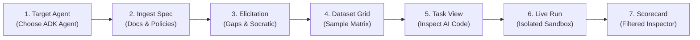

# Spec: EvalStudio AI — UI/UX & Functional Improvements (Phase 1.5)

## 1. Objective

This specification details a focused set of UI/UX simplifications, layout reorganizations, and functional improvements for **EvalStudio AI**. The primary goal is to transform busy, cluttered screens into intuitive, high-clarity workflows that empower non-technical and technical users alike to configure, inspect, execute, and analyze GenAI agent evaluations without cognitive friction.

### Guiding Principles
* **Simplicity & Focus Over Density**: Eliminate multi-column visual clutter (e.g. 3-column layouts on a single screen) in favor of purposeful 2-part split workflows (Active Work vs. Live Results).
* **Target-First Intent**: Establish the agent under evaluation as the foundational context before asking users to supply requirements or policy documents.
* **Code Scannability & High-Value Placement**: Present executable Inspect AI task definitions (`@task`, scorers, solvers) at the very top of code inspection views, isolating raw test dataset records (`RAW_SAMPLES`) into dedicated, non-obstructive sub-views.
* **Cohesive Multi-Dimensional Filtering**: Connect high-level diagnostic visualizations (Category Pass Rate Distribution) directly to granular inspection data (Sample Execution Inspector) via interactive 1-click filtering.

---

## 2. Scope & Phase Boundaries

### In-Scope Improvements
1. **Initiative 1: Dedicated Target Agent Selection Step (New Step 1)**:
   * Decouple Target Agent Selection from the "Ingest Spec" view into a dedicated first step in the global wizard navigation bar.
   * Total sequence increases from 6 to 7 clear, bite-sized steps:
     1. Target Agent
     2. Ingest Spec
     3. Elicitation
     4. Dataset Grid
     5. Task View
     6. Live Run
     7. Scorecard
   * Display detected/inferred agent tools, agent module spec, and agent metadata as a prominent inspection summary before proceeding.
   * Lay the architectural foundation for agent-aware document ingestion and template recommendations.

2. **Initiative 2: Inspect AI Task Code & Dataset Samples Decoupling (Step 5 / Task View)**:
   * Restructure task code generation in `code_generator.py` and the frontend `CodeViewer.tsx` / `DualView.tsx` component.
   * Place the primary `@task` definition, solvers, scorers, and runtime parameters at the very top of the generated Python script.
   * Provide a tabbed or modular code presentation in the UI (`task.py` vs. `samples.json` / `samples.py`) so users instantly inspect the task architecture without scrolling past hundreds of serialized sample records.

3. **Initiative 3: Elicitation Workbench Simplification (Step 3 / Elicitation)**:
   * Replace the visually congested 3-column layout (Ambiguities 4-col + Socratic Chat 4-col + Confirmed Criteria 4-col) with a balanced **2-Pane Workspace**:
     * **Pane A: Active Work Area (Left, ~60% width)** with clean tab switching:
       * **Tab 1: "Detected Gaps & Ambiguities"** (with live open-count badge, full-width gap cards, 1-click resolutions, and inline custom decision forms).
       * **Tab 2: "Socratic Chat Assistant"** (conversational dialogue with Gemini 2.5, quick-reply options, and inline rule suggestion chips).
     * **Pane B: Live Evaluation Criteria & Results (Right, ~40% width)**:
       * Persistent, real-time summary of Confirmed Criteria (Business Rules, Safety Constraints, Edge Cases, Expected Tools).
       * Direct inline editing and deletion capabilities.
       * Prominent sticky bottom progress bar and "Confirm Criteria & Synthesize Dataset" CTA.

4. **Initiative 4: Category-Grouped Filtering in Scorecard & Sample Inspector (Step 7 / Scorecard)**:
   * Make the "Category Pass Rate Distribution" bars interactive: clicking any category row selects/filters by that category.
   * Add active category filter indicators with 1-click deselect ("✕") in the Sample Execution Inspector table header.
   * Maintain the existing `[All]`, `[Passed]`, `[Failed]` status pills, ensuring they combine multiplicatively with the active category filter.
   * Update count badges dynamically to reflect the current category scope.

### Out of Scope (Deferred to Later Phases)
* Live AST code mutation of target agent Python files directly in the browser.
* Multi-agent simultaneous batch evaluation runs in parallel pipelines.
* Persistent cloud database migration (preserving local file/memory contracts for Phase 1.5).

---

## 3. Workflow & Sequence Architecture

### Updated 7-Step Global Wizard Flow



### Architectural Analysis: Why Agent Selection Belongs in Step 1
* **Context Priming**: Knowing the target agent (e.g. `examples/customer_support_adk/agent.py:root_agent`) upfront allows EvalStudio AI to inspect declared tools (`lookup_order`, `process_refund`, `escalate_to_human`) and agent descriptions immediately.
* **Domain Alignment**: Step 2 ("Ingest Spec") can leverage the selected agent's domain to automatically highlight compatible sample benchmarks (e.g., E-Commerce Refund Policy for the Customer Support Agent, HR Handbook for the HR Benefits Agent).
* **Intelligent Gap Detection**: In Step 3, the Socratic Elicitation agent operates with dual context: the customer's policy rules *and* the target agent's declared tool interfaces, instantly flagging discrepancies (e.g., policy requires checking shipping carrier status, but agent has no shipping tool).

---

## 4. Tech Stack & Tooling

| Component | Technology | Version | Purpose |
|---|---|---|---|
| **Frontend Framework** | React + TypeScript + Vite | React 18, Vite 5 | Core web UI, responsive components |
| **Styling & Icons** | Tailwind CSS + Lucide React | Tailwind 3.4, Lucide 0.344 | Minimalist dark UI, system typography, icons |
| **State Management** | React Hooks (`useState`, `useMemo`, `useCallback`) | React 18 | Local component & wizard step state |
| **Backend API** | FastAPI (Python 3.11) | FastAPI 0.110+ | REST endpoints & SSE execution streams |
| **Execution Engine** | Inspect AI | 0.3.50+ | Evaluation harness, tasks, solvers, scorers |
| **Agent Framework** | Google Agent Development Kit (ADK) | 0.1.0+ | Target agent definitions & internal elicitation judges |
| **LLM Provider** | Google Vertex AI (Gemini 2.5 Pro / Flash) | ADC Authenticated | Socratic elicitation, dataset synthesis, judges |

---

## 5. Detailed Component & UI/UX Specifications

### 5.1 Initiative 1: Dedicated Target Agent Selection Step (Step 1)

#### User Problem
In the current application, selecting the target agent is wedged into the top of Step 1 ("Document & Requirement Ingestion"). It clutters the document upload area and treats the agent as a secondary configuration setting rather than the primary subject of the evaluation.

#### Proposed UI/UX Design
* **Step Name**: `1. Target Agent` (Icon: `Bot`).
* **Header**:
  * Badge: `Step 1: Target Agent Specification`
  * Heading: **"Select or Specify the Agent Under Test"**
  * Subheading: *"Choose a local Google ADK agent project or select from pre-configured domain templates. EvalStudio AI will inspect its declared tools and capabilities."*
* **Layout**:
  * **Option A: Pre-Configured Sample Agents**:
    * Grid of interactive cards (e.g. *Customer Support ADK Agent*, *HR Benefits ADK Agent*).
    * Each card displays: Agent Name, Domain description, Python entrypoint path (`agent.py:root_agent`), and tool chips.
    * Selected state: Highlighted border (`border-sky-500`), subtle glow (`shadow-sky-500/10`), active radio checkmark.
  * **Option B: Custom ADK Agent Specification**:
    * Input field for custom local entrypoints (e.g. `path/to/project/agent.py:root_agent`).
    * "Inspect Agent" validation button with real-time status feedback.
  * **Agent Inspector Summary Card**:
    * Automatically displays the introspected agent metadata: declared tools list (`lookup_order`, `process_refund`, etc.), system entrypoint, and validation status (Ready for Evaluation).
  * **Action Button**:
    * Bottom right: `Proceed to Specification Ingestion →` (advances to Step 2).

#### Component Architecture
* **New Component**: `frontend/src/components/agent/AgentSelector.tsx`
* **Modified Component**: `frontend/src/components/ingest/DocumentUploader.tsx` (removes agent selector card, refocuses 100% on document upload/paste/sample selection).
* **Updated Navigator**: `frontend/src/components/layout/StepNavigator.tsx` updated with 7 steps:
  ```typescript
  const STEPS = [
    { id: 1, label: '1. Target Agent', icon: Bot },
    { id: 2, label: '2. Ingest Spec', icon: FileText },
    { id: 3, label: '3. Elicitation', icon: MessageSquare },
    { id: 4, label: '4. Dataset Grid', icon: Database },
    { id: 5, label: '5. Task View', icon: Layers },
    { id: 6, label: '6. Live Run', icon: PlayCircle },
    { id: 7, label: '7. Scorecard', icon: Award },
  ];
  ```

---

### 5.2 Initiative 2: Inspect AI Task Code & Dataset Samples Decoupling (Step 5 / Task View)

#### User Problem
In the current code generator (`backend/app/utils/code_generator.py`), `RAW_SAMPLES = [...]` is rendered at line 48 directly above the `@task` definition. For realistic evaluation suites of 50–200 samples, this JSON block spans 2,000 to 8,000 lines of code. When users switch to the "Inspect AI Task Code" tab, they are greeted by an unending wall of raw data artifacts and must scroll extensively to find the actual task definition, solvers, and multi-scorers.

#### Proposed Solution: Two-Pronged Decoupling

##### 1. Backend Code Structure Reorganization
* Re-order the generated Python script so that the **Task Definition is immediately at the top**, right below imports:
  ```python
  """
  Inspect AI Task Definition generated by EvalStudio AI.
  Runnable via CLI: inspect eval task.py
  """

  from inspect_ai import Task, task
  from inspect_ai.dataset import MemoryDataset, Sample
  from inspect_ai.scorer import accuracy, mean, stderr
  from app.core.scorers import (
      model_graded_qa_scorer,
      policy_adherence_scorer,
      tool_verification_scorer,
  )
  from app.core.bridge import adk_agent_solver

  # =====================================================================
  # 1. Inspect Task Definition with Multi-Scorers & Sandbox Configuration
  # =====================================================================
  @task
  def eval_customer_support_rules() -> Task:
      return Task(
          dataset=get_dataset(),
          solver=adk_agent_solver(target_spec="examples/customer_support_adk/agent.py:root_agent"),
          scorer=[
              model_graded_qa_scorer(),
              policy_adherence_scorer(),
              tool_verification_scorer(),
          ],
          fail_on_error=False,
          time_limit=60,
          message_limit=10,
      )

  # =====================================================================
  # 2. Dataset Loader & Memory Dataset Builder
  # =====================================================================
  def get_dataset() -> MemoryDataset:
      return MemoryDataset(
          samples=[
              Sample(id=s["id"], input=s["input"], target=s["target"], metadata=s["metadata"])
              for s in RAW_SAMPLES
          ],
          name="Customer Support Evaluation Dataset",
          location="memory",
      )

  # =====================================================================
  # 3. Categorized Test Samples (50 Records)
  # =====================================================================
  RAW_SAMPLES = [ ... ]  # Placed cleanly at bottom of script
  ```

##### 2. Frontend Code Viewer Multi-File Tab Navigation
* In `frontend/src/components/visualization/CodeViewer.tsx`, provide a file sub-tab switcher:
  * **Tab 1: `task.py` (Inspect AI Task Definition)** — Focused, concise Python code (~60 lines) showing the `@task` decorator, solvers, scorers, and runtime limits.
  * **Tab 2: `samples.json` (Dataset Samples)** — Dedicated view of the serialized sample records with sample count badge, search/syntax highlighting, and separate download option (`download task.py` vs `download samples.json`).
* In the API response (`CompiledTaskResponse`), optionally deliver `task_code` (clean task definition) and `samples_json_str` (dataset samples) so the UI can render them independently or as companion files.

---

### 5.3 Initiative 3: Elicitation Workbench Simplification (Step 3 / Elicitation)

#### User Problem
Step 2 (now Step 3 in the 7-step sequence) currently places 3 complex columns side-by-side in a 12-column grid (`4-col` Gaps + `4-col` Socratic Chat + `4-col` Confirmed Criteria).
* On standard laptop viewports (1366x768 to 1920x1080), each column is squashed to ~350px.
* Users face sensory overload: 3 simultaneous scrolling areas, multiple nested buttons, dropdowns, input boxes, and chips all competing for attention.

#### Proposed 2-Pane Split Architecture

```
┌─────────────────────────────────────────────────────────────┬──────────────────────────────────────────┐
│  PANE A: Active Work Area (~60% / 7 cols)                  │  PANE B: Live Criteria & Results (~40%) │
│                                                             │                                          │
│  ┌─────────────────────────┬─────────────────────────────┐  │  ┌────────────────────────────────────┐  │
│  │ [!] Detected Gaps (3)   │ [Bot] Socratic Assistant    │  │  │ Confirmed Evaluation Criteria      │  │
│  └─────────────────────────┴─────────────────────────────┘  │  │ (3 Rules, 2 Safety, 2 Tools)       │  │
│                                                             │  │                                    │  │
│  [When Tab 1 Active: Gaps & Ambiguities]                    │  │ ▾ Target Agent & Tools             │  │
│  • Full-width gap cards with clear typography               │  │   • lookup_order, process_refund   │  │
│  • Filter pills: All (3) | Open (1) | Resolved (2)          │  │ ▾ Business Rules                   │  │
│  • 1-click decision buttons with green highlight            │  │   1. 30-day return window [Edit][X]│  │
│  • "+ Custom Decision" expandable form                      │  │   2. Opened hygiene non-refundable │  │
│                                                             │  │ ▾ Safety & Refusal Constraints     │  │
│  [When Tab 2 Active: Socratic Assistant]                    │  │   1. Never disclose API keys       │  │
│  • Spacious chat container with Gemini 2.5                 │  │                                    │  │
│  • Quick-reply suggestion chips                             │  │ ────────────────────────────────── │  │
│  • "Add to Confirmed Rules" 1-click action inside bot reply │  │ Progress: 2/3 Gaps Resolved        │  │
│                                                             │  │ [ Confirm & Synthesize Dataset -> ] │  │
└─────────────────────────────────────────────────────────────┴──────────────────────────────────────────┘
```

#### Detailed Breakdown of the 2 Panes

##### Pane A: Active Work Area (Left Pane, 7 Columns / ~60% Width)
* **Tab Header**:
  * **Tab 1: Detected Gaps & Ambiguities**:
    * Badge indicator: Open count (e.g. `1 Open` in amber, or `✓ All Resolved` in emerald).
    * Filter bar: `All (N)` | `Open (N)` | `Resolved (N)`.
    * Card layout: Ample horizontal width allowing full questions, rule impact descriptions, and prominent 1-click decision pills without wrapping into tiny illegible blocks.
  * **Tab 2: Socratic Chat Assistant**:
    * Clean conversation thread with Gemini 2.5.
    * Allows deep natural language exploration of ambiguous requirements.
    * When the agent answers a question or recommends a rule, it renders an inline chip: `+ Add rule to Confirmed Criteria`.

##### Pane B: Confirmed Evaluation Criteria (Right Pane, 5 Columns / ~40% Width)
* **Purpose**: Serves as the "Live Blueprint" showing the exact criteria synthesized so far.
* **Content Sections**:
  1. **Agent & Tools Spec**: Read-only display of target agent and inferred tools, with an optional "+ Add Expected Tool" action.
  2. **Core Business Rules**: Collapsible list with inline Edit (`Edit3`), Delete (`Trash2`), and "+ Add Rule".
  3. **Safety & Refusal Policies**: Strict refusal constraints with inline controls.
  4. **Edge Cases**: Unhappy path rules and exceptional handling criteria.
* **Sticky Bottom Confirmation Bar**:
  * Live status text: `"2 of 3 Gaps Addressed (Ready for dataset synthesis)"`.
  * Primary Action CTA:
    * If gaps remain open: `Confirm Criteria & Synthesize Dataset →` (Sky button).
    * If all gaps resolved: `✓ All Gaps Addressed: Synthesize Dataset →` (Emerald button).

---

### 5.4 Initiative 4: Category-Grouped Filtering in Scorecard & Sample Inspector (Step 7 / Scorecard)

#### User Problem
In Step 6 (now Step 7), the "Sample Execution Inspector" displays all 50–200 executed samples with only `[All]`, `[Passed]`, and `[Failed]` filters.
Although the "Category Pass Rate Distribution (Inspect AI Grouped Metrics)" visualizes pass rates across categories (`happy_path`, `edge_case`, `adversarial`, `tool_usage`, etc.), clicking a category does nothing. Users inspecting adversarial failures have to manually scan through dozens of unrelated happy-path samples.

#### Proposed UI/UX Interaction Design

##### 1. Interactive Category Distribution Cards
* In the Category Pass Rate Distribution container, each category row becomes an interactive selector:
  * Default state: Hover highlight (`hover:bg-slate-800/60`, cursor pointer).
  * Selected state: Highlighted background (`bg-sky-950/40`), border (`border-sky-500/50`), and an active filter indicator dot.
  * Click behavior: Clicking a category selects it. Clicking the currently selected category deselects it (toggles back to all categories).

##### 2. Integrated Filter Controls in Sample Inspector Table Header
* The table header provides a unified filtering toolbar:
  * **Category Filter Chip**: When a category is active:
    ```
    Filtered by: [ Adversarial  ✕ ]
    ```
    Clicking `✕` immediately clears the category filter.
  * **Status Filter Segmented Control**:
    `[ All (12) ]` `[ Passed (9) ]` `[ Failed (3) ]`
    These counts dynamically recalculate based on the active category! If no category is selected, counts reflect the full dataset.
  * **Quick Category Dropdown / Pill Selector** (optional helper directly above table for fast mobile or direct switching).

##### 3. Multiplicative Filter Logic
```typescript
const filteredSamples = useMemo(() => {
  return scorecard.sample_details.filter((sample) => {
    // 1. Category Filter
    const matchesCategory = selectedCategory
      ? sample.category.toLowerCase() === selectedCategory.toLowerCase()
      : true;

    // 2. Status Filter
    const matchesStatus =
      filterPassed === 'passed' ? sample.passed :
      filterPassed === 'failed' ? !sample.passed : true;

    return matchesCategory && matchesStatus;
  });
}, [scorecard.sample_details, selectedCategory, filterPassed]);
```

---

## 6. Project Structure & Modified Files

```
eval-studio-ai/
├── backend/
│   └── app/
│       ├── models/
│       │   └── task.py                     # Support modular task_code vs samples_json
│       └── utils/
│           └── code_generator.py           # Put @task at top; isolate RAW_SAMPLES to bottom/helper
├── frontend/
│   └── src/
│       ├── App.tsx                         # 7-step wizard state machine & step handlers
│       ├── types/
│       │   └── index.ts                    # Updated step indices & task response types
│       ├── components/
│       │   ├── agent/
│       │   │   └── AgentSelector.tsx       # [NEW] Dedicated Step 1: Target Agent Selection
│       │   ├── layout/
│       │   │   └── StepNavigator.tsx       # Updated 7-step icons, labels, and clickable gates
│       │   ├── ingest/
│       │   │   └── DocumentUploader.tsx    # Streamlined Step 2: Ingest Spec (agent selector extracted)
│       │   ├── chat/
│       │   │   └── ChatInterface.tsx       # Redesigned Step 3: 2-pane workbench (Tabs + Criteria)
│       │   ├── visualization/
│       │   │   ├── DualView.tsx            # Updated Step 5: Task View
│       │   │   └── CodeViewer.tsx          # Multi-file tabs: task.py vs samples.json
│       │   └── scorecard/
│       │       └── ScorecardDashboard.tsx  # Step 7: Interactive category filter & dual-axis table
```

---

## 7. API Data Contracts

### 7.1 Agent Inspection Endpoint (`GET /api/agents/inspect`)
```json
{
  "spec": "examples/customer_support_adk/agent.py:root_agent",
  "tools": ["lookup_order", "process_refund", "escalate_to_human"],
  "description": "E-commerce refund and customer service agent",
  "status": "valid"
}
```

### 7.2 Compiled Task Response (`POST /api/task/compile`)
```json
{
  "task_id": "task_eval_ecommerce_1709560000",
  "task_name": "eval_ecommerce_refund_policy",
  "task_code": "# Clean Inspect AI @task definition (imports, solvers, scorers, limits)\n...",
  "samples_json": "[{\"id\": \"sample-01\", \"input\": \"...\", \"target\": \"...\", \"metadata\": {...}}]",
  "sample_count": 50,
  "config": {
    "target_agent_path": "examples/customer_support_adk/agent.py:root_agent",
    "fail_on_error": false,
    "time_limit_seconds": 60,
    "message_limit": 10
  },
  "mermaid_diagram": {
    "diagram_code": "sequenceDiagram\n..."
  }
}
```

---

## 8. Commands & Execution

### Local Development
```bash
# Backend (FastAPI on port 8000)
cd backend
uv run uvicorn app.main:app --reload --port 8000

# Frontend (Vite on port 5173 with proxy to 8000)
cd frontend
npm run dev

# Run Backend Unit & Integration Tests
cd backend
uv run pytest tests/ -v

# Run Frontend Tests & Linting
cd frontend
npm run test
npm run lint
```

---

## 9. Code Style & Quality Standards

* **Clean Code & Functional Decomposition**: Avoid monolithic components (> 600 lines). Sub-components (e.g. `GapInboxTab`, `CriteriaSummaryPane`) should be cleanly separated with explicit TypeScript props.
* **Accessibility (a11y)**:
  * All interactive elements have descriptive `aria-label` or visible text.
  * Keyboard navigation support (Tab / Enter / Space) for category filter bars and tabs.
* **Responsive Visual Hierarchy**:
  * Maintain consistent dark-slate color tokens (`bg-slate-950`, `bg-slate-900/60`, `border-slate-800`).
  * Action states use standard semantic accents: Emerald for positive/completion, Sky for primary actions, Amber for warnings/open gaps, Rose for failures.

---

## 10. Testing Strategy

### 10.1 Frontend Unit & Component Tests
* **`AgentSelector.test.tsx`**:
  * Verify rendering of pre-configured sample agents.
  * Test selection of an agent and callback invocation with correct spec.
* **`StepNavigator.test.tsx`**:
  * Verify rendering of all 7 step pills.
  * Test gate disabling for unreached steps and step click handling.
* **`ChatInterface.test.tsx` (Elicitation 2-Pane)**:
  * Verify tab switching between "Detected Gaps & Ambiguities" and "Socratic Chat Assistant".
  * Verify resolving a gap updates the open badge counter and reflects immediately in the Confirmed Criteria pane.
* **`ScorecardDashboard.test.tsx` (Category Filtering)**:
  * Test clicking a category in "Category Pass Rate Distribution" activates filtering.
  * Verify filtered samples count matches expected category and status combination.
  * Test 1-click deselecting category clears filter back to all samples.

### 10.2 Backend Tests
* **`test_code_generator.py`**:
  * Verify `generate_task_python_code` places the `@task` function before the `RAW_SAMPLES` or references a clean loader.
  * Verify generated code syntax is valid Python (`compile(code, "task.py", "exec")`).

---

## 11. Boundaries & Operational Guardrails

### Always Do
* Keep the wizard step state machine linear and deterministic (`currentStep`, `maxStepReached`).
* Ensure all existing backend API contracts remain backwards-compatible.
* Test responsiveness across viewports (1280px, 1440px, 1920px).

### Ask First
* Altering the database schema or persistent storage model.
* Adding heavy external npm packages (e.g. additional charting libraries) when Tailwind and native SVG suffice.

### Never Do
* Embed secrets, API keys, or GCP credentials into code or commits.
* Re-introduce 3-column horizontally congested layouts on Step 3.
* Force users to scroll through `RAW_SAMPLES` to view Inspect AI task code.

---

## 12. Success Criteria & Verification Matrix

| Area | Requirement | Verifiable Condition |
|---|---|---|
| **Step 1** | Dedicated Agent Selection | Step 1 is "Target Agent". Ingest Spec is Step 2. Users can pick sample or custom agent before ingesting spec. |
| **Step 3** | Simplified Elicitation | 2-pane layout (Active Work tabs + Live Criteria pane). No 3-column squeeze. Gap count badge live-updates. |
| **Step 5** | Task Code Scannability | `@task` definition is visible immediately at the top of the code viewer. `RAW_SAMPLES` does not obstruct the view. |
| **Step 7** | Interactive Category Filter | Clicking a category in the breakdown filters the sample inspector table. Combined with Pass/Fail pills. Easy 1-click clear. |
| **Quality** | Build & Test Cleanliness | Frontend `npm run build` succeeds with 0 TypeScript errors. Backend tests pass 100%. |

---

## 13. Collaborative UI/UX Decision Record

### Decision 1: Placement of Target Agent Selection as Step 1
* **Context**: Should choosing an agent be Step 1 (before document ingestion) or Step 2 (after ingestion)?
* **Collaborative Evaluation**:
  * *Option A (Step 1 - Recommended)*: Set target agent first.
    * *Pros*: Establishes clear context. EvalStudio AI can immediately introspect agent tools and suggest compatible benchmark policies in Step 2.
    * *Cons*: User must select an agent before seeing the document ingestion screen. (Mitigated by pre-selecting default sample agent).
  * *Option B (Step 2)*: Ingest document first, then choose agent.
    * *Pros*: Focuses on requirements first.
    * *Cons*: Disconnected from agent capabilities; cannot recommend agent-tailored policies.
* **Status**: **APPROVED by User** — Proceed with **Step 1: Target Agent**.

### Decision 2: 2-Pane Split for Elicitation Workbench
* **Context**: How to de-clutter the 3 views (Gaps, Socratic Chat, Confirmed Criteria)?
* **Collaborative Evaluation**:
  * *Option A (2-Pane: Tabs for Active Work + Persistent Results Pane - Recommended)*:
    * *Pros*: Active work is focused (tabs), while results are always visible side-by-side. Immediate visual confirmation when rules are resolved.
    * *Cons*: Requires tab clicking to switch between gaps and chat.
  * *Option B (Sequential Sub-Wizard: Step 2A Gaps -> Step 2B Chat -> Step 2C Criteria)*:
    * *Pros*: Maximum focus on one thing at a time.
    * *Cons*: Artificial barrier between chat and gaps; slows down users who want quick resolution.
* **Status**: **APPROVED by User** — Proceed with **2-Pane Workspace with Active Work Tabs** (`Detected Gaps & Ambiguities` / `Socratic Chat Assistant`) and persistent `Confirmed Evaluation Criteria` results pane.

### Decision 3: Multi-Tab Switcher for Task Code vs. Dataset Samples
* **Context**: Should Inspect AI task code and sample datasets be separated via a multi-tab file switcher or kept in a single file with samples at the bottom?
* **Collaborative Evaluation**:
  * *Option A (Multi-Tab Switcher - Recommended)*:
    * File tabs: `task.py` (concise Inspect AI task definition, multi-scorers, and solvers) vs. `samples.json` (categorized dataset records).
    * *Pros*: High structure and visibility; completely decouples data artifacts from task logic without forcing the user to scroll or parse thousands of JSON lines.
  * *Option B (Single File with bottom samples)*:
    * *Cons*: Still produces a massive multi-thousand-line file in a single code block.
* **Status**: **APPROVED by User** — Implement **Multi-Tab File Switcher** in `CodeViewer.tsx` / `DualView.tsx`.

### Decision 4: Scorecard Category Filtering & Smooth Deselection Interaction
* **Context**: How should the user select and unselect categories to filter sample executions?
* **Collaborative Evaluation**:
  * *Interactive Distribution Bars + Filter Toolbar*:
    * Clicking any category row in "Category Pass Rate Distribution" selects that category.
    * Clicking the same category row again, or clicking a dedicated "Clear Category (✕)" pill in the table toolbar, unselects it smoothly.
    * When a category is active, it displays a distinct highlight ring and an active badge in the table header: `Category: [Adversarial ✕]`.
    * Unselecting smoothly transitions the table back to all categories with zero layout jitter, and preserves the active `[All]`, `[Passed]`, or `[Failed]` status toggle.
* **Status**: **APPROVED by User** — Implement interactive distribution bars with polished, intuitive deselect interactions.
