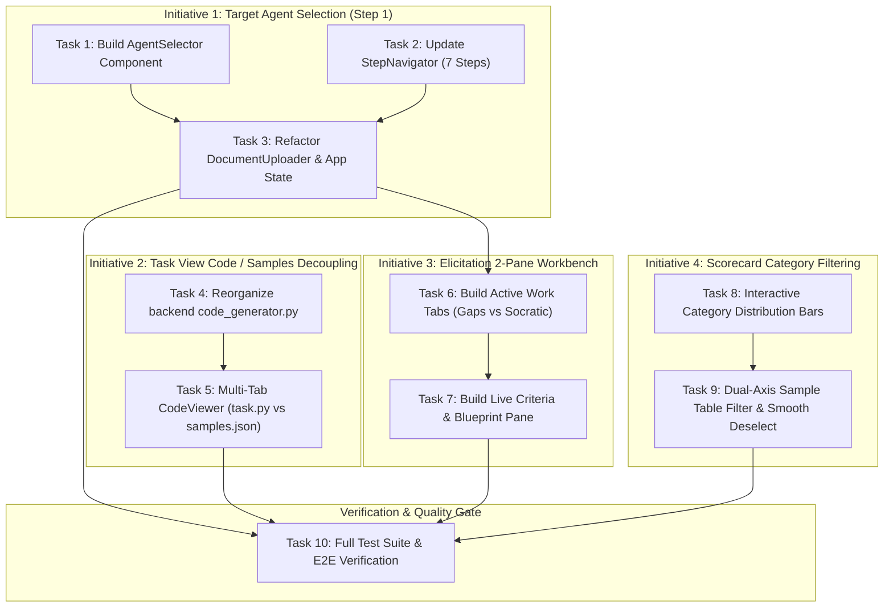

# Implementation Plan: EvalStudio AI — UI/UX & Functional Improvements (Phase 1.5)

## Overview
This implementation plan operationalizes the approved specification in `tasks/ui-ux-improve/SPEC.md`. It executes four key UI/UX and functional improvements across EvalStudio AI:
1. Promoting Target Agent Selection into a dedicated **Step 1** within an expanded 7-step wizard.
2. Decoupling Inspect AI Task Code from raw dataset samples via modular code generation and a multi-tab file switcher in the Task View.
3. De-cluttering the Socratic Elicitation Workbench from a 3-column squeeze into an intuitive **2-Pane Workspace** (Active Work Tabs + Live Confirmed Criteria).
4. Enabling interactive category-grouped filtering in the Executive Scorecard with polished, smooth selection and deselection.

---

## Architecture Decisions

1. **Step Machine Extension (6 to 7 Steps)**:
   * Wizard sequence: `1. Target Agent` → `2. Ingest Spec` → `3. Elicitation` → `4. Dataset Grid` → `5. Task View` → `6. Live Run` → `7. Scorecard`.
   * Gating logic in `App.tsx` (`currentStep`, `maxStepReached`) updated to preserve progression safety. Selecting an agent unlocks Step 2.

2. **Component Extraction & Decoupling**:
   * Extract agent selection from `DocumentUploader.tsx` into a standalone, reusable `AgentSelector.tsx` component.
   * `DocumentUploader.tsx` becomes focused exclusively on requirement documents, policy uploads, and plain-text stories.

3. **Multi-Tab Code & Artifact Presentation**:
   * Refactor `backend/app/utils/code_generator.py` so `@task` definition and multi-scorers appear at the top.
   * Update `CodeViewer.tsx` to support a multi-file tab navigation bar: `task.py` (concise task definition) vs. `samples.json` (serialized samples).

4. **2-Pane Elicitation Layout**:
   * Left Pane (~60% width): Tabbed container (`[AlertTriangle] Detected Gaps (N)` vs. `[Bot] Socratic Assistant`).
   * Right Pane (~40% width): Live Criteria Blueprint with real-time reactive updates from either active work tab, plus sticky bottom confirmation CTA.

5. **Multiplicative Filter State in Scorecard**:
   * Interactive Category Pass Rate Distribution bars set `selectedCategory: string | null`.
   * Clear interaction available via clicking active category bar again or clicking `[Category: Name ✕]` in the table toolbar.
   * Dynamic recalculation of `All (N)`, `Passed (N)`, and `Failed (N)` counts within the filtered category scope.

---

## Dependency Graph

---

## Task List

### Phase 1: Dedicated Target Agent Selection Step (Step 1)
- [ ] **Task 1**: Build Standalone `AgentSelector.tsx` Component
- [ ] **Task 2**: Update `StepNavigator.tsx` for 7-Step Sequence
- [ ] **Task 3**: Refactor `DocumentUploader.tsx` & Integrate 7-Step Sequence in `App.tsx`

#### Checkpoint: Phase 1 Complete
- [ ] Frontend builds cleanly (`npm run build`).
- [ ] Step 1 allows selecting an agent and transitions smoothly to Step 2.
- [ ] Document uploader on Step 2 is clean and free of agent selection clutter.

### Phase 2: Task View Code & Dataset Samples Decoupling (Step 5)
- [ ] **Task 4**: Reorganize Task Code Generation in Backend (`code_generator.py`)
- [ ] **Task 5**: Multi-Tab `CodeViewer.tsx` & `DualView.tsx` Integration

#### Checkpoint: Phase 2 Complete
- [ ] Backend tests pass (`uv run pytest tests/ -v`).
- [ ] Generated `task.py` has `@task` at top.
- [ ] Multi-tab switcher in Task View allows inspecting task code without scrolling past samples.

### Phase 3: Socratic Elicitation Workbench Simplification (Step 3)
- [ ] **Task 6**: Restructure `ChatInterface.tsx` to 2-Pane Split with Active Work Tabs
- [ ] **Task 7**: Refactor Confirmed Criteria Results Blueprint & Actions

#### Checkpoint: Phase 3 Complete
- [ ] Frontend builds cleanly (`npm run build`).
- [ ] Step 3 displays a clean 2-Pane layout without visual congestion.
- [ ] Real-time reactive synchronization between active work tabs and criteria pane verified.

### Phase 4: Scorecard Category-Grouped Filtering (Step 7)
- [ ] **Task 8**: Interactive Category Pass Rate Distribution Bars
- [ ] **Task 9**: Dual-Axis Sample Table Filtering & Smooth Deselect Toolbar

#### Checkpoint: Phase 4 Complete
- [ ] Frontend builds cleanly (`npm run build`).
- [ ] Category selection and smooth deselection in Scorecard verified.
- [ ] Dual-axis filtering and dynamic count recalculations verified.

### Phase 5: Verification & Quality Gate
- [ ] **Task 10**: Full Test Suite & End-to-End User Flow Verification

#### Checkpoint: Phase 5 Complete
- [ ] Backend tests pass 100%.
- [ ] Frontend typecheck and build pass with 0 errors.
- [ ] Complete 7-step user flow runs end-to-end.

---

## Risks and Mitigations

| Risk | Impact | Mitigation |
|---|---|---|
| Step index shift breaks state machine | High | Step progression is centralized in `App.tsx` and indexed deterministically in `StepNavigator.tsx`. |
| Generated Python script syntax errors when reordering | Medium | Unit tests validate syntax using Python's `compile(code, "task.py", "exec")`. |
| Large criteria lists cause overflow in 2-pane layout | Low | Right pane uses contained vertical scrolling (`overflow-y-auto max-h-[560px]`) with sticky confirmation footer. |
| Complex state combinations during category filtering in Scorecard | Low | Pure computed memoization (`useMemo`) combining `selectedCategory` and `filterPassed` guarantees predictable state without race conditions. |

---

## Open Questions
None. All design decisions were reviewed and approved during the specification phase.
